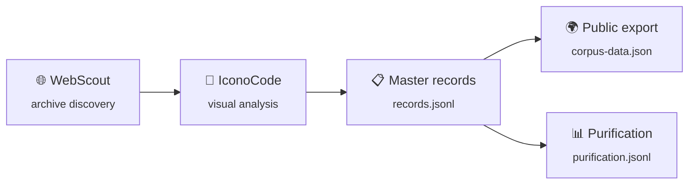

<!-- Banner -->
<p align="center">
  
</p>

<h1 align="center">
  <em>Iconocracia</em>
</h1>

<p align="center">
  <strong>Female Allegory in the History of Legal Culture</strong><br>
  <em>Alegoria Feminina na História da Cultura Jurídica (Séculos XIX–XX)</em>
</p>

<p align="center">
  <a href="LICENSE"></a>
  <a href="LICENSE"></a>
  <a href="https://hf.co/datasets/warholana/iconocracy-corpus"></a>
  <a href="https://iconocracia.com"></a>
</p>

<p align="center">
  
  
  
  
</p>

---

> **Research question:** How does the female allegorical figure — Justice, the Republic, Marianne, Britannia, Columbia — get *hardened* into an instrument of state and legal power?
>
> This repository is the research monorepo for a doctoral thesis (PPGD/UFSC, defense 2028) that brings together a searchable open corpus, a dual-agent visual-coding pipeline, iconometric analysis, and the thesis manuscript itself.

---

## Table of Contents

- [Why this matters](#why-this-matters)
- [The corpus at a glance](#the-corpus-at-a-glance)
- [Core concept: *endurecimento*](#core-concept-endurecimento)
- [The dual-agent pipeline](#the-dual-agent-pipeline)
- [Repository layout](#repository-layout)
- [Quickstart](#quickstart)
- [Thesis architecture](#thesis-architecture)
- [Data model & traceability](#data-model--traceability)
- [Related resources](#related-resources)
- [Citation](#citation)
- [License](#license)

---

## Why this matters

From courthouse pediments to postage stamps, from banknotes to monuments, the female allegory has long served as the visual grammar of legal and political authority. She is *universal* — every modern state has her — yet she is *particular*, carrying the racial, sexual, and colonial marks of the regime that produced her.

This project treats her not as decoration but as **evidence**. Each figure is a trace of how the state imagines itself — and, crucially, how it imagines the female body as a suitable vessel for abstract power. The corpus traces this process across two centuries and four continents, asking not only *what* these figures mean, but *how they were made to mean it*.

**Four original conceptual contributions** (Vanzin 2028):

| Concept | What it names |
|---------|---------------|
| **Contrato Sexual Visual** | The tacit agreement by which the female body becomes the default support for allegorical abstraction |
| **Feminilidade de Estado** | The regime-specific molding of feminine traits into tokens of political legitimacy |
| **Contrato Racial Visual** | The whitening / Europeanization embedded in the "universal" allegorical type |
| **Purificação Clássica** | The progressive stripping of bodily particularity that transforms living figure into state emblem — operationalized as *endurecimento* |

---

## The corpus at a glance

*Working snapshot — August 2026. The corpus is exploratory, not frozen; counts grow until defense.*

| Metric | Value |
|--------|-------|
| **Coded records** | 335 (`data/processed/records.jsonl`) |
| **Public export** | 335 (`corpus/corpus-data.json`) |
| **Endurecimento coding** | 286 (`data/processed/purification.jsonl`) |
| **Vault catalog cards** | 413 (`vault/candidatos/`) |

### By country

| 🇫🇷 FR | 🇧🇷 BR | 🇺🇸 US | 🇩🇪 DE | 🇬🇧 UK | 🇮🇹 IT | 🇵🇹 PT | 🇧🇪 BE | 🇳🇱 NL | 🇪🇸 ES | + |
|--------|--------|--------|--------|--------|--------|--------|--------|--------|--------|---|
| 97 | 72 | 32 | 27 | 23 | 20 | 11 | 11 | 10 | 7 | AT, DK, MX, CL, AR… |

### By iconocratic regime

| Regime | Count | Character |
|--------|-------|-----------|
| **Fundacional** | 158 | Sacrificial, body alive |
| **Normativo** | 102 | Domesticated, bureaucratic |
| **Militar** | 54 | Hardened, imperial |
| **Contra-alegoria** | 14 | Subversive, contested |

### Coverage

- **Supports:** coin · stamp · monument/sculpture · courthouse architecture · print/engraving · frontispiece · banknote · poster
- **Period:** 1800–2000 (priority 1880–1920)
- **Sources:** Brasiliana Fotográfica · Hemeroteca Digital Brasileira · Gallica (BnF) · Europeana · Biblioteca Nacional Digital (Portugal) · Library of Congress · Bildindex der Kunst und Architektur

**Inclusion criteria** (all four required): a female allegorical figure · with an explicit juridical-political function · datable 1800–2000 · on an accepted support. Country is an *analytical variable*, **not** a gate — the "universal" allegory is transnational by design.

---

## Core concept: *endurecimento*

The thesis measures how allegorical female figures are progressively **hardened** (*endurecimento*) into abstract instruments of the state. Every item is scored on **10 ordinal indicators (0–3)**:

| # | Indicator (PT) | English gloss | What it captures |
|---|----------------|---------------|------------------|
| 1 | `desincorporação` | disembodiment | Loss of bodily particularity |
| 2 | `rigidez_postural` | postural rigidity | Frozen, architectural stance |
| 3 | `dessexualização` | de-sexualization | Suppression of erotic charge |
| 4 | `uniformização_facial` | facial uniformization | Generic, mask-like features |
| 5 | `heraldização` | heraldic abstraction | Shield, crest, armorial coding |
| 6 | `enquadramento_arquitetônico` | architectural framing | Column, pediment, monumentality |
| 7 | `apagamento_narrativo` | narrative erasure | Loss of scene, story, action |
| 8 | `monocromatização` | monochromatization | Reduction to single hue or metal |
| 9 | `serialidade` | seriality | Mass reproduction, identical copies |
| 10 | `inscrição_estatal` | state inscription | Crown, motto, initials, dating |

The sum feeds an `endurecimento_score` (0–30) and places each figure along the regime trajectory:

```
Fundacional  ──▶  Normativo  ──▶  Militar
   (body)          (bureau)        (state)
        \_______________/
              |
       Contra-alegoria
        (subversion)
```

---

## The dual-agent pipeline



1. **WebScout** queries digital archives (Europeana, Gallica, LOC, BnF, Numista, Colnect) for candidate figures and contextual metadata.
2. **IconoCode** performs a 3-level Panofsky analysis (pre-iconographic → iconographic → iconological) plus the 10 *endurecimento* indicators.
3. Output flows into the canonical ledger (`records.jsonl`) and is exported to the public corpus (`corpus-data.json`).

A separate **ARGOS** workflow orchestrates batch acquisition: manifest → dispatch groups → validation report.

---

## Repository layout

```
iconocracy-corpus/
├── corpus/              # Searchable corpus + self-contained HTML dashboards
│   ├── index.html              # Browser search interface
│   ├── corpus-data.json        # Public export (canonical public surface)
│   ├── DASHBOARD_CORPUS.html   # Interactive dashboard (Chart.js)
│   └── atlas-iconometrico.html # Visual atlas
│
├── data/
│   ├── raw/              # Manifests & Drive links ONLY — never binaries (ADR-001)
│   ├── interim/          # Data in transformation
│   └── processed/        # records.jsonl + purification.jsonl (canonical ledgers)
│
├── tools/
│   ├── scripts/          # ~100 Python automation scripts
│   ├── schemas/          # JSON schemas (master-record, IconoCode, WebScout)
│   └── sql/              # DB migrations for the dual-agent corpus
│
├── tese/                 # Doctoral manuscript, revisions, research notes
│   ├── manuscrito/       # Chapters (Markdown → Pandoc)
│   └── revisoes/         # ABNT + terminological audits
│
├── notebooks/            # Analysis 01–08
│   # exploratory → Kruskal-Wallis → regression → correspondence
│   # → temporal → clustering → dimensionality → multidimensional scoring
│
├── vault/                # Obsidian vault (candidatos/ catalog cards, templates)
├── docs/                 # Specs, ADRs, operating model, workflows
├── deploy/               # Cloudflare Workers companion, HF Space
├── tests/                # pytest suite (~32 files)
├── .agents/              # Agent skills and orchestration configs
│
├── environment.yml · requirements.txt · CITATION.cff · LICENSE
```

---

## Quickstart

```bash
# 1. Environment (conda, Python 3.11)
conda env create -f environment.yml
conda activate iconocracy

# 2. Browse the corpus — no build needed; open in any browser
open corpus/DASHBOARD_CORPUS.html   # macOS
# or: corpus/index.html

# 3. Validate the data
python tools/scripts/validate_schemas.py

# 4. Preview records → public-export diff
python tools/scripts/records_to_corpus.py --diff

# 5. Check endurecimento coding progress
python tools/scripts/code_purification.py --status

# 6. Run the tests
pytest tests/
```

Every Python tool is run **from the repo root**: `python tools/scripts/<script>.py`.

### Release gate

Before any public / Hugging Face snapshot, run in order:

```
validate_schemas.py → code_purification.py --status → vault_sync.py status
  → records_to_corpus.py --diff → build_hf_release.py
```

See [`docs/OPERATING_MODEL.md`](docs/OPERATING_MODEL.md) for the full protocol.

---

## Thesis architecture

Four case studies across two centuries:

| Case | Period | Allegorical figures | Archive anchor |
|------|--------|---------------------|----------------|
| **Brasil-República** | 1889–1930 | A República, A Justiça | Brasiliana Fotográfica, Hemeroteca Digital |
| **Brasil-Tribunais** | 20th c. | Justiça vendada no STF | STF, Acervos judiciários |
| **França-Marianne** | 1789–1946 | Marianne, La République, La Justice | Gallica, Monnaie de Paris |
| **UK-Britannia** | 1800–1950 | Britannia, Justice, Hibernia | British Museum, NPG |

Read three ways — **historical**, **theoretical-conceptual**, and **comparative-postcolonial** — across four theoretical clusters: Legal History · Visual Culture · Feminist Theory · Post-colonial studies.

> **Master plan:** [`docs/PLANO-TESE-ICONOCRACIA.md`](docs/PLANO-TESE-ICONOCRACIA.md) — full architecture, methodology, case rankings, risk matrix, and work plan.

---

## Data model & traceability

Canonical source-of-truth hierarchy:

1. **`data/processed/records.jsonl`** — operational canonical ledger
2. **`corpus/corpus-data.json`** — public-facing export (browsers, dashboards, HF)
3. **`data/processed/purification.jsonl`** — *endurecimento* coding ledger
4. **`vault/candidatos/`** — auxiliary cataloguing mirror

**Public-export fields:** `id`, `title`, `date`, `country`, `motif`, `regime`, `description`, `url`, `endurecimento_score`, `indicadores`, `citation_abnt`.

**Coding fields** (`subtipo`, `familia_alegorica`, `vetor_colonial`, `hipotese_racial`, …) live nested under `purificacao` in `records.jsonl` and are flattened into the export by `records_to_corpus.py`. **Never hand-edit `corpus-data.json`**; edit the source and regenerate.

**Traceability rule:** every item exists in three places — Google Drive (`data/raw/drive-manifest.json`) · a vault card in `vault/candidatos/` · a master record in `records.jsonl`. Per **ADR-001**, `data/raw/` stays metadata-only in git; binaries live on Google Drive.

CI (`.github/workflows/validate.yml`) validates the ledger against the schema, checks consistency with the export, and rejects binaries in `data/raw/`.

---

## Related resources

| Resource | Link |
|----------|------|
| 🤗 Hugging Face dataset | [warholana/iconocracy-corpus](https://hf.co/datasets/warholana/iconocracy-corpus) |
| 🌐 Project site | [iconocracia.com](https://iconocracia.com) |
| 📐 Iconclass | [iconclass.org](https://iconclass.org/) |
| 📄 Operating model | [`docs/OPERATING_MODEL.md`](docs/OPERATING_MODEL.md) |
| 🃏 Agent reference | [`AGENTS.md`](AGENTS.md) · [`CLAUDE.md`](CLAUDE.md) |

---

## Citation

If you use this corpus or the tools in your research, please cite:

```bibtex
@misc{vanzin2026iconocracy,
  author    = {Vanzin, Ana},
  title     = {Iconocracy: Female Allegory in the History of Legal Culture},
  year      = {2026},
  publisher = {GitHub},
  url       = {https://github.com/anavvanzin/iconocracy-corpus}
}
```

Machine-readable metadata: [`CITATION.cff`](CITATION.cff).

---

## License

- **Code and tools:** MIT
- **Corpus metadata:** CC BY 4.0
- **Individual images:** subject to the rights indicated in each entry

---

<p align="center">
  <em>PPGD/UFSC · Defesa prevista: setembro 2028</em><br>
  <a href="https://github.com/anavvanzin/iconocracy-corpus">github.com/anavvanzin/iconocracy-corpus</a>
</p>
