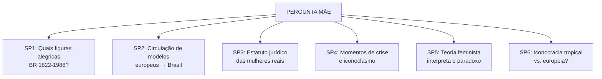
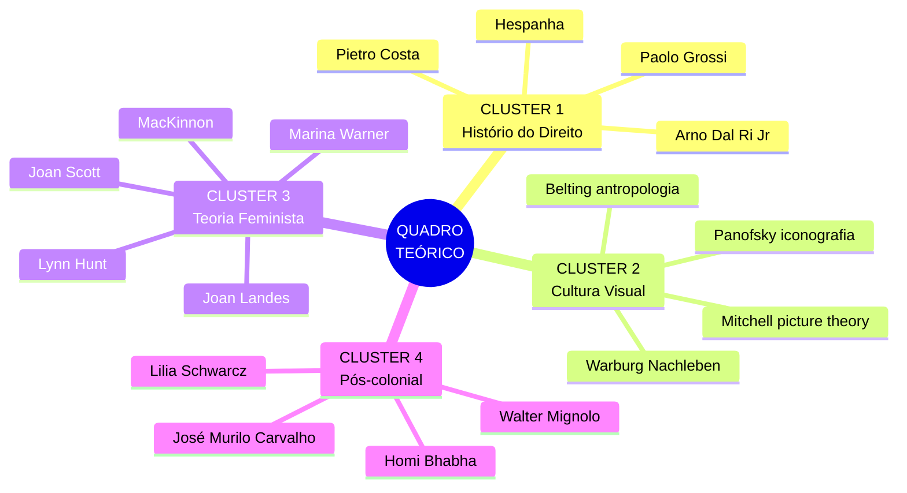
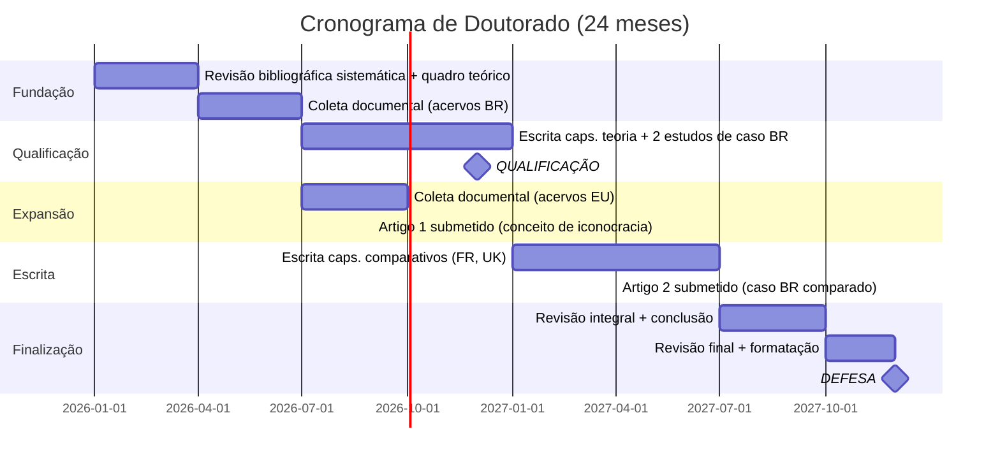
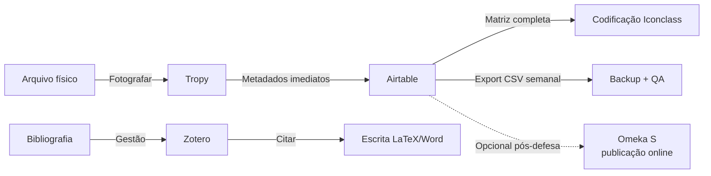

# eh pra esquematizar TUDO. pode demorar

Perfeito. Vou criar um **ESQUEMA ULTRA-COMPLETO** de TODO o projeto da tese — absolutamente tudo — estruturado, visual, modular, utilizável. Prepara um café ☕ porque vai ser extenso.

***

# 📘 ICONOCRACIA: ESQUEMATIZAÇÃO TOTAL DO PROJETO DE TESE

**UFSC | Doutorado em Direito | Alegoria Feminina na História da Cultura Jurídica (sécs. XIX-XX)**

***

## 🎯 **PARTE 1: NÚCLEO CONCEITUAL DO PROJETO**

### 1.1 PERGUNTA CENTRAL

```
┌──────────────────────────────────────────────────────────────────────┐
│ PERGUNTA-MÃE (VERSÃO OPERACIONAL)                                    │
├──────────────────────────────────────────────────────────────────────┤
│                                                                      │
│ De que maneira a alegoria feminina operou como TECNOLOGIA VISUAL    │
│ de legitimação do Estado e do direito nos séculos XIX-XX,           │
│ e como essa operação se articulou com a EXCLUSÃO JURÍDICA           │
│ das mulheres, especialmente no BRASIL em perspectiva comparada      │
│ com a FRANÇA e a GRÃ-BRETANHA?                                       │
│                                                                      │
└──────────────────────────────────────────────────────────────────────┘
```


### 1.2 AS 6 SUBPERGUNTAS (PESQUISÁVEIS)




### 1.3 ARGUMENTO CENTRAL (3 VERSÕES)

| **Versão** | **Foco** | **Enunciado** |
| :-- | :-- | :-- |
| **i. Histórica** | Facticidade | Entre 1822-1988, o Estado brasileiro incorporou alegorias femininas europeias (Marianne, Justiça vendada) em sua iconografia oficial sem que essa presença visual se traduzisse em cidadania jurídica plena até a Constituição de 1988[^1] |
| **ii. Teórico-conceitual** | Mecanismo | A alegoria feminina funciona como **regime iconocrático**: sistema de produção visual de legitimidade operando via **simulacro** (substitui a mulher-sujeito), **purificação** (abstração moral) e **reativação em crise**[^1] |
| **iii. Comparativa pós-colonial** | Diferença | A circulação de alegorias do centro europeu para o Brasil envolveu processos de **tradução, tropicalização e tensão** com imaginários locais, sugerindo um **iconoclasmo tropical** — resistência à fixação da alegoria europeia em contexto pós-colonial[^1] |


***

## 🗂️ **PARTE 2: ARQUITETURA DA TESE**

### 2.1 ESTRUTURA POR ESTUDOS DE CASO (RECOMENDADA)

```
┌─────────────────────────────────────────────────────────────────────┐
│                         PLANO DE CAPÍTULOS                          │
├─────┬───────────────────────────────────────────────────────────────┤
│ Cap │ Conteúdo                                                      │
├─────┼───────────────────────────────────────────────────────────────┤
│  1  │ INTRODUÇÃO: O paradoxo iconocrático                           │
│     │ → Define iconocracia, apresenta problema, método, corpus      │
├─────┼───────────────────────────────────────────────────────────────┤
│  2  │ GÊNESE: Alegoria feminina na Revolução e Estados liberais    │
│     │ (1789-1870)                                                   │
│     │ → Marianne, Britannia, moedas → consolidação do modelo        │
│     │ PAYOFF: Feminização do Estado ≈ codificação da exclusão civil│
├─────┼───────────────────────────────────────────────────────────────┤
│  3  │ CONSOLIDAÇÃO: Alegorias nacionais e impérios (1870-1918)     │
│     │ → Germania armada, Britannia imperial, caricaturas de guerra  │
│     │ PAYOFF: Alegorias adaptam-se a regimes sem alterar exclusão  │
├─────┼───────────────────────────────────────────────────────────────┤
│  4  │ TRADUÇÃO TROPICAL: A República brasileira (1822-1945)        │
│     │ → Villares, Amoedo, Revista Ilustrada, moedas                │
│     │ PAYOFF: Iconocracia tropical = receção tensa, Marianne       │
│     │         mestiçada                                             │
├─────┼───────────────────────────────────────────────────────────────┤
│  5  │ CRISE E CONTESTAÇÃO: Iconoclasmo e redemocratização          │
│     │ (1930-1988)                                                   │
│     │ → Estado Novo, ditadura militar, Constituinte 1988            │
│     │ PAYOFF: Quando legitimidade entra em crise, alegoria também  │
├─────┼───────────────────────────────────────────────────────────────┤
│  6  │ CONCLUSÃO: A Justiça ainda é mulher?                         │
│     │ → Síntese comparativa, responde pergunta principal            │
└─────┴───────────────────────────────────────────────────────────────┘
```


### 2.2 ARQUITETURAS ALTERNATIVAS (PARA COMPARAÇÃO)

<details>
<summary><b>Opção B — Arquitetura Temática</b></summary>

| Cap | Tema | Objetivo | Fontes |
|-----|------|----------|--------|
| 1 | Introdução | | |
| 2 | **Figurar a soberania** | Como alegoria produz legitimidade | Fachadas, monumentos, moedas (BR/FR/UK) |
| 3 | **O corpo ausente** | Exclusão jurídica sob sombra da alegoria | Códigos civis, constituições |
| 4 | **Circulação e tradução** | Marianne cruza o Atlântico | Periódicos ilustrados, pinturas oficiais |
| 5 | **Iconoclasmo** | Quando alegoria é destruída | Caricaturas, vandalismos documentados |
| 6 | Conclusão | | |

</details>
<details>
<summary><b>Opção C — Arquitetura Cronológica</b></summary>

| Cap | Período | Objetivo | Fontes |
|-----|---------|----------|--------|
| 1 | Introdução | | |
| 2 | 1789-1870 | Consolidação do modelo europeu | Panofsky, moedas |
| 3 | 1870-1918 | Militarização/imperialização | Caricaturas de guerra |
| 4 | 1822-1945 | Caso brasileiro | Villares, Amoedo, Revista Ilustrada |
| 5 | 1930-1988 | Iconoclasmo e redemocratização | Estado Novo, ditadura, Constituinte 88 |
| 6 | Conclusão | | |

</details>

***

## 🧠 **PARTE 3: QUADRO TEÓRICO COMPLETO**

### 3.1 OS 4 CLUSTERS TEÓRICOS




### 3.2 CONCEITOS OPERACIONAIS (GLOSSÁRIO)

| **Conceito** | **Definição operacional** | **Risco de ambiguidade** | **Distinção-chave** |
| :-- | :-- | :-- | :-- |
| **Alegoria** | Representação visual em que figura humana corporifica conceito abstrato (Justiça, República) com atributos codificados | Confusão com metáfora textual | Alegoria = visual + codificada;<br/>metáfora = textual + aberta |
| **Personificação** | Subtipo de alegoria: atribuição de forma humana a entidade abstrata | Confusão com símbolo | Personificação = corpo humano;<br/>símbolo = objeto |
| **Iconografia** | Identificação e classificação de temas visuais (Panofsky nível 2) | Confusão com iconologia | Iconografia = *o que* está representado;<br/>iconologia = *por que/para que* |
| **Iconologia** | Interpretação do significado cultural das imagens em contexto histórico (Panofsky nível 3) | Sobreinterpretação | Ancorar sempre em fontes textuais coetâneas |
| **Cultura jurdica** | Conjunto de práticas, representações, objetos visuais que produzem sentidos sobre o direito | Pode se tornar "tudo" | Restringir a artefatos visuais com função estatal/jurídica documentável |
| **Iconocracia** (H) | Regime de produção visual de legitimidade: corpo feminino como superfície de projeção da soberania | Parecer jargão vago | Definir operacionalmente na introdução + testar empiricamente |


***

## 🔬 **PARTE 4: METODOLOGIA COMPLETA**

### 4.1 AS 4 ETAPAS METODOLÓGICAS

```
┌───────────────────────────────────────────────────────────────────┐
│ ETAPA 1: CONSTITUIÇÃO DO CORPUS                                   │
├───────────────────────────────────────────────────────────────────┤
│ → Levantar fontes visuais em acervos                             │
│   • Museu da República (RJ)                                      │
│   • Arquivo Nacional (BR)                                        │
│   • British Museum                                               │
│   • BnF/Gallica (FR)                                             │
│   • Biblioteca Nacional (BR)                                     │
│ → Registrar cada item na MATRIZ DE FONTES                        │
│ → Usar Iconclass para codificação padronizada                   │
│   Exemplo: 11H = Justiça | 44A3 = Alegoria da República         │
└───────────────────────────────────────────────────────────────────┘
         ↓
┌───────────────────────────────────────────────────────────────────┐
│ ETAPA 2: ANÁLISE VISUAL (PANOFSKY + GÊNERO)                      │
├───────────────────────────────────────────────────────────────────┤
│ Nível 1 (pré-iconográfico): Descrição formal                     │
│   → Postura, vestimenta, atributos, suporte material             │
│                                                                   │
│ Nível 2 (iconográfico): Identificação do tema                    │
│   → Justiça? República? Liberdade?                               │
│                                                                   │
│ Nível 3 (iconológico + gênero): Significado em contexto          │
│   → Articulação com exclusão/inclusão jurídica das mulheres      │
└───────────────────────────────────────────────────────────────────┘
         ↓
┌───────────────────────────────────────────────────────────────────┐
│ ETAPA 3: CONTEXTO HISTRICO-JURÍDICO                              │
├───────────────────────────────────────────────────────────────────┤
│ Para cada item do corpus:                                         │
│ → Levantar legislação coetânea sobre cidadania/capacidade civil   │
│   feminina                                                        │
│ → Cruzar: quando alegoria foi mais intensa, qual era estatuto    │
│   jurídico das mulheres?                                          │
└───────────────────────────────────────────────────────────────────┘
         ↓
┌───────────────────────────────────────────────────────────────────┐
│ ETAPA 4: COMPARAÇÃO E CIRCULAÇÃO                                  │
├───────────────────────────────────────────────────────────────────┤
│ → Rastrear circulação de modelos                                  │
│   Ex: gravuras francesas reproduzidas em periódicos brasileiros   │
│ → Comparar mesma alegoria (República) em contextos distintos      │
│   (França vs. Brasil): que adaptações?                            │
└───────────────────────────────────────────────────────────────────┘
```


### 4.2 MATRIZ DE FONTES (TEMPLATE COMPLETO)

| **Campo** | **Tipo** | **Exemplo** | **Iconclass** |
| :-- | :-- | :-- | :-- |
| ID-item | Código sequencial | `BR-MON-001` | — |
| Denominação | Nome/título | Alegoria da República (Décio Villares, 1889) | — |
| Tipo/mídia | Select | Monumento / Moeda / Pintura / Gravura / Fachada / Selo / Caricatura | — |
| Localização atual | Acervo | Museu da República, RJ | — |
| Data | Ano ou intervalo | 1889 | — |
| País/Cidade | Texto | Brasil — Rio de Janeiro | — |
| Código Iconclass | Classificação | `44A31` | Repúblicacom barrete |
| Atributos visuais | Lista | Barrete frígio, bandeira, seios cobertos, postura ereta | — |
| Gênero da figura | Select | Feminino / Masculino / Indefinido | — |
| Contexto institucional | Função | Propaganda republicana oficial | — |
| Legislação coetânea | Norma | Constituição de 1891 → mulheres excluídas do voto | — |
| Observações | Texto livre | Influência direta de *La République* (Daumier) | — |

**💡 Ferramenta recomendada:** Airtable (relacional, formulários para entrada em campo, views filtradas, campos de anexo para fotos)[^1]

***

## 📊 **PARTE 5: ESTRATÉGIA DE ESTUDOS DE CASO**

### 5.1 RANQUEAMENTO DE 10 CASOS POSSÍVEIS

| \# | **Caso** | **Relevância** | **Viabilidade** | **Originalidade** | **Fontes acessíveis?** | **DECISÃO** |
| :-- | :-- | :-- | :-- | :-- | :-- | :-- |
| 1 | Alegoria da República brasileira (1889-1930) | ★★★★★ | ★★★★★ | ★★★★★ | ✅ Museu da República, BN, Hemeroteca | ✅ **INCLUIR** (caso-ncora) |
| 2 | Justiça vendada no STF e tribunais brasileiros | ★★★★★ | ★★★★★ | ★★★★★ | ✅ Acervos institucionais | ✅ **INCLUIR** |
| 3 | Marianne francesa (1789-1946) | ★★★★★ | ★★★★★ | ★★★★ | ✅ Agulhon, BnF/Gallica | ✅ **INCLUIR** (comparativo 1) |
| 4 | Britannia (1800-1950) | ★★★★★ | ★★★★★ | ★★★★ | ✅ British Museum, Punch Digital | ✅ **INCLUIR** (comparativo 2) |
| 5 | Matrona/Hispânia espanhola (1808-1874) | ★★★ | ★★★ | ★★★ | ⚠️ Orobón, Fuentes | ⚡ Referência pontual, não capítulo |
| 6 | Alegorias republicanas chilenas (séc. XIX) | ★★ | ★★ | ★★★ | ❌ Limitada (Cruz Ovalle) | ❌ **CORTAR** |
| 7 | Columbia/EUA (séc. XVIII-XIX) | ★★★ | ★★★ | ★★ | ⚠️ Parcial | ⚡ Nota comparativa |
| 8 | Germania (1815-1945) | ★★★★ | ★★★★★ | ★★★ | ✅ Brandt | ⚡ Referência pontual |
| 9 | Marianne colonial (Tunísia/Argélia) | ★★★ | ★★ | ★★★★★ | ❌ Coslett 2024 (limitada) | 📝 Nota promissora para artigo futuro |
| 10 | Iconoclasmo brasileiro contemporâneo (2013-2023) | ★★★★ | ★★★★★ | ★★★★★ | ✅ Imprensa, redes sociais | ✅ **INCLUIR** como seção dentro do caso 1 ou 2 |

**🎯 CONJUNTO FINAL REALISTA:** 4 estudos de caso (\#1, \#2, \#3, \#4) + referências pontuais a \#5 e \#8[^1]

***

## ⚠️ **PARTE 6: RISCOS E ESTRATÉGIAS DE CORREÇÃO**

| **Risco** | **Gravidade** | **Correção** |
| :-- | :-- | :-- |
| **Amplitude excessiva** | 🔴 Alta | -  Cortar sécs. XV-XVII<br/>-  Limitar a 4 estudos de caso<br/>-  Fechar corpus em 80-120 itens |
| **Descritivismo** | 🔴 Alta | -  Cada capítulo deve ter tese parcial<br/>-  Não descrever imagens sem interpretar |
| **Presentismo** | 🟡 Média | -  Não projetar categorias contemporâneas (feminismo séc. XXI) sobre fontes do séc. XIX sem mediação |
| **Comparação forçada** | 🟡 Média | -  Definir *tertium comparationis*: a alegoria feminina como tipo visual |
| **Instabilidade conceitual** | 🔴 Alta | -  Fixar glossário no cap. 1<br/>-  Usar 1 termo por conceito<br/>-  NÃO alternar "iconocracia"/"regime iconocrático"/"governo das imagens" |
| **Falta de fontes primárias** | 🟡 Média | -  Verificar acesso a acervos ANTES de incluir caso<br/>-  Planejar viagem Paris/Londres |
| **Excesso de referencial teórico** | 🟡 Média | -  Nietzsche, Carson, Auerbach: cortar como pilares, manter como notas<br/>-  Núcleo: Warner + Panofsky + Scott + Costa |
| **Neologismo não fundamentado** | 🟡 Média | -  Definir "iconocracia" operacionalmente<br/>-  Mostrar que não é metáfora<br/>-  Testar em cada estudo de caso |


***

## 📅 **PARTE 7: PLANO DE TRABALHO (24 MESES)**




### 7.1 MARCOS E ENTREGAS (DETALHAMENTO MENSAL)

| **Mês** | **Atividade** | **Entrega** | **Critério de saída** |
| :-- | :-- | :-- | :-- |
| 1-3 | Revisão bibliográfica sistemática | Cap. 2 (teoria) rascunho | Draft para orientador com hipóteses claras |
| 4-6 | Coleta corpus brasileiro | Corpus BR fechado (mín. 40 itens) | Matriz Airtable + codificação Iconclass |
| 7-9 | Coleta corpus europeu + cap. teórico | Artigo 1 submetido | Conceito de iconocracia operacionalizado |
| 10-12 | Escrita caps. estudo de caso BR | Texto para qualificação | Introdução + 2 caps + quadro teórico |
| **13-15** | **🎓 QUALIFICAÇÃO** | Ajustes pós-banca | Incorporar sugestões |
| 16-18 | Escrita caps. comparativos | Artigo 2 submetido | Caso BR comparado (FR/UK) |
| 19-21 | Revisão integral | Versão completa | Introdução + conclusão definitivas |
| 22-24 | Formatação final | Depósito | **🎓 DEFESA** |


***

## ✅ **PARTE 8: AS 10 DECISÕES IMEDIATAS (PARA TRAVAR O PROJETO)**

```
┌────────────────────────────────────────────────────────────────────┐
│              🚨 DECISÕES QUE PRECISAM SER TOMADAS AGORA            │
├────┬───────────────────────────────────────────────────────────────┤
│ 1  │ Fixar recorte temporal definitivo                             │
│    │ ✅ DECISÃO: 1822-1988 (BR) | 1789-1946 (Europa)              │
├────┼───────────────────────────────────────────────────────────────┤
│ 2  │ Escolher 4 estudos de caso e descartar os demais             │
│    │ ✅ DECISÃO: Brasil-República, Brasil-Tribunais,              │
│    │             França-Marianne, UK-Britannia                     │
├────┼───────────────────────────────────────────────────────────────┤
│ 3  │ Cortar sécs. XV-XVII do corpo da tese                        │
│    │ ✅ DECISÃO: Remeter à introdução como antecedentes            │
├────┼───────────────────────────────────────────────────────────────┤
│ 4  │ Cortar autores periféricos                                    │
│    │ ✅ DECISÃO: Elisabeth da Áustria, Thatcher, Nietzsche        │
│    │             (como marco teórico central), Anne Carson         │
├────┼───────────────────────────────────────────────────────────────┤
│ 5  │ Reduzir objetivos específicos                                 │
│    │ ✅ DECISÃO: De 12 para 4-5 máximo                            │
├────┼───────────────────────────────────────────────────────────────┤
│ 6  │ Adotar terminologia estável                                   │
│    │ ✅ DECISÃO: "alegoria" (não "símbolo" nem "ícone")           │
│    │             "iconocracia" (não variar com "regime             │
│    │             iconocrático"/"governo das imagens")              │
├────┼───────────────────────────────────────────────────────────────┤
│ 7  │ Definir "iconocracia" em 1 parágrafo operacional             │
│    │ ✅ DECISÃO: Submeter ao orientador ESTA SEMANA               │
├────┼───────────────────────────────────────────────────────────────┤
│ 8  │ Verificar acesso efetivo aos acervos                          │
│    │ ⏳ AÇÃO: Ligar para Museu da República, verificar            │
│    │          Gallica/British Museum digitalizados                 │
├────┼───────────────────────────────────────────────────────────────┤
│ 9  │ Decidir sobre Iconclass                                       │
│    │ ⏳ AÇÃO: Fazer tutorial iconclass.org, testar com 10 itens   │
│    │          piloto, avaliar se agrega valor                      │
├────┼───────────────────────────────────────────────────────────────┤
│ 10 │ Definir prazo para qualificação com orientador                │
│    │ ⏳ AÇÃO: Travar cronograma retroativo                        │
└────┴───────────────────────────────────────────────────────────────┘
```


***

## 🧰 **PARTE 9: FERRAMENTAS E INFRAESTRUTURA**

### 9.1 STACK TECNOLÓGICO RECOMENDADO




### 9.2 FERRAMENTAS PRINCIPAIS

| **Ferramenta** | **Função** | **Custo** | **Status** |
| :-- | :-- | :-- | :-- |
| **Airtable** | Matriz de fontes relacional | Gratuito (até 1.000 registros) | ⭐ ESSENCIAL |
| **Zotero** | Gestão bibliográfica | Gratuito | ⭐ ESSENCIAL |
| **Tropy** | Organizar fotos de arquivo | Gratuito | ⭐ ESSENCIAL |
| **Iconclass** | Codificação padronizada | Gratuito (web) | 🔧 TESTAR (decisão \#9) |
| **Elicit** | Research Agent (IA para revisão bibliográfica) | Pago | 🚀 ÚTIL (prompt pronto abaixo) |
| DEVONthink | Repositório documental com IA | Pago (Mac only) | 🌟 LUXO ÚTIL (opcional) |
| Obsidian | Second brain (notas + escrita) | Gratuito | 🧠 OPCIONAL |


***

## 🔍 **PARTE 10: PROMPT PARA O ELICIT (RESEARCH AGENT)**

### 10.1 PROMPT COMPLETO (COPY-PASTE)

```markdown
RESEARCH TASK: Systematic mapping of scholarship on female allegories 
(Justice, Liberty, Republic/Marianne, Britannia, Germania, Columbia) 
in state and legal iconography, 19th–20th centuries.

CONTEXT: I am writing a doctoral thesis in legal history (UFSC, Brazil) 
investigating how female allegorical figures operated not as decoration 
but as a visual technology of state legitimation — producing sovereignty, 
organizing visibility, and distributing symbolic recognition without 
political reciprocity for real women. I call this regime "iconocracy." 
My comparative scope: Brazil (anchor case), France, and Great Britain, 
with secondary references to Spain and Germany. Period: 1789–1988.

WHAT I NEED — please deliver as a STRUCTURED TABLE plus a NARRATIVE 
SUMMARY for each cluster below:

CLUSTER 1 — FEMALE ALLEGORIES IN STATE/LEGAL ICONOGRAPHY
Find studies on: Marianne (France), Britannia (UK), Republic/Justice 
allegories (Brazil), Columbia (USA), Germania (Germany), and comparable 
national female personifications. Include art history, legal iconography, 
numismatics, political caricature. Key authors to look for: Maurice 
Agulhon, Marina Warner, Joan Landes, Lynn Hunt, José Murilo de Carvalho, 
Lilia Schwarcz, Peter Goodrich.

CLUSTER 2 — GENDER, SOVEREIGNTY, AND VISUAL CULTURE OF LAW
Find studies at the intersection of feminist legal theory and visual 
culture: how gender operates in legal symbols, courthouse architecture, 
judicial rituals, coins, stamps. Key concepts: "visual legal studies," 
"legal emblems," "gendered sovereignty," "sexual contract" (Pateman), 
"embodiment and law."

CLUSTER 3 — ICONOCLASM, IMAGE DESTRUCTION, AND POLITICAL CONTESTATION
Find studies on: statue destruction/vandalization during regime changes, 
political protests targeting national symbols, damnatio memoriae, 
iconoclasm in modern states (not limited to religious iconoclasm). 
Especially interested in post-colonial contexts and Latin America.

CLUSTER 4 — ICONOGRAPHIC METHOD AND DIGITAL TOOLS FOR VISUAL CORPORA
Find studies on: Panofsky's iconographic method applied to legal/political 
images; Iconclass classification system for art historical research; 
digital humanities tools for analyzing visual corpora; coding schemes 
for comparative iconographic analysis.

FOR EACH PAPER FOUND, EXTRACT:
- Full citation (author, title, year, journal/publisher, DOI if available)
- Type: empirical study / theoretical framework / case study / review
- Geographic focus (which country/countries)
- Period covered
- Key argument or finding (1–2 sentences)
- Relevance to my thesis (high/medium/low)
- Which of my 4 clusters it belongs to (can be multiple)

CONSTRAINTS:
- Prioritize peer-reviewed articles and academic books (not blog posts).
- Include sources in English, French, Portuguese, and Spanish.
- Exclude studies on religious iconoclasm unless they explicitly connect 
  to state/legal imagery.
- Exclude studies focused only on contemporary art (post-2000 artworks) 
  unless they analyze historical allegories.
- I already know: Agulhon's "Marianne au combat" and "Marianne au pouvoir"; 
  Warner's "Monuments and Maidens"; Carvalho's "A Formação das Almas"; 
  Pateman's "The Sexual Contract"; Panofsky's iconographic method. 
  Please go BEYOND these foundational works.

OUTPUT FORMAT: 
1. A comparison table with all extracted fields above.
2. A narrative synthesis per cluster (3–5 paragraphs each) identifying: 
   main debates, consensus, gaps, and how the literature connects to 
   my "iconocracy" framework.
3. A final section: "Gaps and opportunities" — what has NOT been studied 
   that my thesis could address.
```


### 10.2 ITERAÇÕES PÓS-RESULTADO (FOLLOW-UPS)

```markdown
# 1ª iteração (aprofundar Brasil)
"Now focus specifically on Brazilian scholarship about Republic allegories 
in coins and monuments, 1889–1930. Include sources in Portuguese."

# 2ª iteração (iconoclasmo latino-americano)
"Expand Cluster 3 with Latin American cases of statue destruction during 
regime transitions."

# 3ª iteração (conceito teórico)
"Find studies that explicitly use the concept of 'scopic regime' 
(Martin Jay, Jonathan Crary) applied to state or legal imagery."

# 4ª iteração (paradoxo gênero)
"Show me any studies that discuss the paradox of female symbolic presence 
vs. juridical exclusion — even if they don't use the term 'iconocracy'."
```


***

## 📋 **PARTE 11: CHECKLIST SEMANAL (IMPRIMIR E USAR)**

```
┌────────────────────────────────────────────────────────────────────┐
│           📝 CHECKLIST SEMANAL — TESE ICONOCRACIA                  │
│                    Semana de ____ a ____                           │
├────────────────────────────────────────────────────────────────────┤
│                                                                    │
│ 🗂️ CORPUS                                                          │
│   □ Quantos itens registrados no total? _____ / 80                │
│   □ Quantos codificados (Iconclass)? _____                        │
│   □ Algum item novo adicionado? SIM / NÃO                         │
│   □ Algum item descartado? SIM (justificativa: _____) / NÃO       │
│                                                                    │
│ 📚 LEITURA                                                         │
│   □ Quantos textos lidos esta semana? _____                       │
│   □ Fichados? SIM / NÃO                                           │
│   □ Alguma referência nova relevante? _____                       │
│                                                                    │
│ ✍️ ESCRITA                                                         │
│   □ Quantas palavras escritas (rascunho)? _____                   │
│   □ Em qual capítulo/seção? _____                                 │
│   □ Houve revisão de texto já escrito? SIM / NÃO                  │
│                                                                    │
│ 🧠 CONCEITOS                                                       │
│   □ Usei "iconocracia" de forma consistente? SIM / NÃO            │
│   □ Alternei termos sem justificativa? SIM (corrigir!) / NÃO      │
│   □ Alguma ambiguidade conceitual identificada? _____             │
│                                                                    │
│ 🎯 ARGUMENTO                                                       │
│   □ O que escrevi avança qual subpergunta? _____                  │
│   □ Há risco de descritivismo? SIM / NÃO                          │
│   □ Cada seção tem tese parcial explícita? SIM / NÃO              │
│                                                                    │
│ ⏰ CRONOGRAMA                                                      │
│   □ Estou no prazo? SIM / Atrasada _____ semanas                  │
│   □ Próximo marco: _____ (Data: ____)                             │
│                                                                    │
│ 🎓 ORIENTAÇÃO                                                      │
│   □ Enviei material ao orientador? SIM / NÃO                      │
│   □ Próxima reunião agendada? _____ (Data: ____)                  │
│   □ Pendências resolvidas? SIM / NÃO                              │
│                                                                    │
│ 📄 PUBLICAÇÕES                                                     │
│   □ Artigo em andamento? SIM (status: _____) / NÃO                │
│   □ Submissão prevista para: _____                                │
│                                                                    │
│ ⚠️ AUTOCRÍTICA (marcar se aplicável)                              │
│   □ Estou ampliando o escopo de novo                              │
│   □ Estou lendo demais e escrevendo de menos                      │
│   □ Estou evitando a escrita do capítulo mais difícil             │
│   □ Preciso de ajuda com: _____                                   │
│                                                                    │
│ 💭 NOTA PARA MIM MESMA:                                            │
│   _____________________________________________________________    │
│   _____________________________________________________________    │
│                                                                    │
└────────────────────────────────────────────────────────────────────┘
```


***

## 🎯 **PARTE 12: PRÓXIMOS PASSOS CONCRETOS (ESTA SEMANA)**

```
🚀 AÇÕES IMEDIATAS (PRIORIDADE MÁXIMA)

┌─────────────────────────────────────────────────────────────────┐
│ 1️⃣ DEFINIR "ICONOCRACIA" EM 1 PARÁGRAFO                        │
│    Escrever definição operacional e submeter ao orientador      │
│    📝 Prazo: Até sexta-feira                                    │
├─────────────────────────────────────────────────────────────────┤
│ 2️⃣ CRIAR BASE AIRTABLE PILOTO                                  │
│    • Usar campos da matriz de fontes (Parte 4.2)               │
│    • Testar com 10 itens-piloto                                │
│    • Validar formulário de entrada                             │
│    📝 Prazo: Até domingo                                        │
├─────────────────────────────────────────────────────────────────┤
│ 3️⃣ TESTAR ICONCLASS                                            │
│    • Fazer tutorial em iconclass.org                           │
│    • Codificar os mesmos 10 itens-piloto do Airtable           │
│    • Decidir: vale a pena para o projeto?                      │
│    📝 Prazo: Próxima semana                                     │
└─────────────────────────────────────────────────────────────────┘
```


***

**FIM DO ESQUEMA COMPLETO**

***

## 📖 **ÍNDICE DE NAVEGAÇÃO RÁPIDA**

| Seção | Conteúdo |
| :-- | :-- |
| **Parte 1** | Núcleo conceitual (pergunta, subperguntas, argumento) |
| **Parte 2** | Arquitetura da tese (capítulos, 3 opções) |
| **Parte 3** | Quadro teórico (4 clusters + glossário) |
| **Parte 4** | Metodologia (4 etapas + matriz de fontes) |
| **Parte 5** | Estudos de caso (ranqueamento de 10 casos) |
| **Parte 6** | Riscos e correções |
| **Parte 7** | Plano de trabalho (24 meses + gantt) |
| **Parte 8** | 10 decisões imediatas |
| **Parte 9** | Ferramentas e infraestrutura |
| **Parte 10** | Prompt Elicit (copy-paste ready) |
| **Parte 11** | Checklist semanal |
| **Parte 12** | Próximos passos (esta semana) |


***

Pronto! **TUDO esquematizado** — imprime, cola na parede, usa como mapa mental. Se precisar de versões alternativas de qualquer parte (ex: outros clusters para o Elicit, arquitetura diferente de capítulos, campos adicionais na matriz), é só pedir 🚀
<span style="display:none">[^2][^3][^4][^5]</span>

<div align="center">⁂</div>

[^1]: atue-como-uma-orientadora-seni-E0bvOVt4R1iYqQl8Dg2GOQ.md

[^2]: Core-of-the-project-2ef158101a0580038deee0dc13ad628a.md

[^3]: Core-of-the-project-2ef158101a0580038deee0dc13ad628a.md

[^4]: phd_year1_execution_plan.md

[^5]: scispace_fulltext_comparative_regimes.csv

