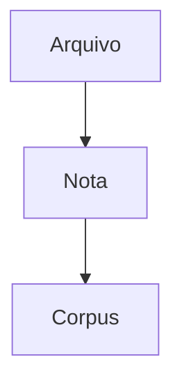

# Guia — Obsidian Flavored Markdown

Este vault adota **Obsidian Flavored Markdown** como padrao para todas as notas em `vault/**/*.md`.

> [!note] Regra geral
> Use `[[wikilinks]]` para notas internas do vault e links Markdown comuns apenas para URLs externas.

## Convencoes do projeto

- Toda nota nova deve abrir com frontmatter YAML.
- Use `title`, `tags`, `aliases`, `created` e `updated` sempre que fizer sentido.
- Prefira `[[Nota]]`, `[[Nota#Secao]]` e `[[Nota|Texto exibido]]` para conexoes internas.
- Use callouts para destaque editorial, metodologico e operacional.
- Use `![[arquivo]]` para embeds internos de notas, imagens e PDFs.
- Use `==highlight==` com parcimonia para marcar pontos decisivos.
- Comentarios internos devem ficar em `%%comentario%%`.

## Frontmatter minimo recomendado

```yaml
---
title: Titulo da nota
aliases: []
tags:
  - projeto/iconocracia
status: rascunho
created: 2026-04-15
updated: 2026-04-15
---
```

## Wikilinks

```markdown
[[Nome da Nota]]
[[Nome da Nota|Texto exibido]]
[[Nome da Nota#Secao]]
[[#Secao nesta nota]]
```

## Embeds

```markdown
![[Nome da Nota]]
![[Nome da Nota#Secao]]
![[imagem.png|300]]
![[documento.pdf#page=3]]
```

## Callouts

```markdown
> [!note]
> Observacao simples.

> [!warning] Atenção
> Ponto de risco ou cuidado.

> [!example]- Exemplo recolhido
> Conteudo expandivel.
```

Tipos mais usados neste projeto:

- `note`
- `info`
- `warning`
- `example`
- `quote`
- `question`
- `todo`

## Comentarios, destaque e tags

```markdown
Texto visivel %%comentario invisivel%%.

==Ponto central==

#projeto/iconocracia
#metodo/panofsky
```

## Matematica e Mermaid

```markdown
Inline: $e^{i\pi} + 1 = 0$


```

## Modelo curto recomendado

```markdown
---
title: Titulo da nota
aliases: []
tags:
  - projeto/iconocracia
status: rascunho
created: 2026-04-15
updated: 2026-04-15
---

# Titulo da nota

> [!note]
> Contexto rapido da nota.

## Conteudo

Texto principal com link para [[Vault]] e referencia metodologica em [[codebook|Codebook]].

## Conexoes

- Nota relacionada: [[Outra Nota]]
- Arquivo embutido: ![[imagem.png|300]]
```

## Template padrao do vault

Para novas notas genericas, use `[[nota-obsidian-padrao]]` em `_templates/`.

## Escopo

Este guia vale para:

- notas gerais de pesquisa
- notas metodologicas
- notas de projeto
- notas de sessao
- rascunhos internos no vault

Notas especializadas, como fichas catalograficas do corpus e templates da tese, podem estender este padrao com campos proprios. ^omf-scope
