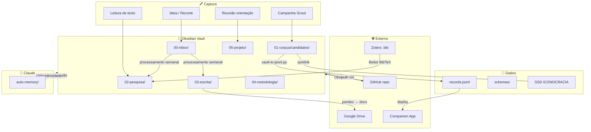

# ICONOCRACY — Knowledge Architecture

**Projeto:** Iconocracia: Alegoria Feminina na História da Cultura Jurídica (Séculos XIX–XX)
**Autora:** Ana Vanzin · PPGD/UFSC
**Versão:** 1.0 · Abril 2026
**Status:** Proposta de arquitetura — para revisão e implementação progressiva

---

## 1. Princípios de Design

A arquitetura segue cinco princípios:

1. **Uma única fonte de verdade por tipo de dado.** Cada informação tem um sistema canônico. Os demais apontam para ele, nunca duplicam.
2. **Captura rápida, estruturação gradual.** Inbox de baixo atrito que desemboca em notas permanentes via templates.
3. **Rastreabilidade trilateral.** Cada item do corpus existe em três pontos: imagem bruta (SSD), nota Obsidian (vault), registro mestre (records.jsonl). Regra já existente no CLAUDE.md — mantida como lei.
4. **Git como coluna vertebral.** Tudo que é texto, dados ou código vive no repositório. Binários grandes ficam no SSD com symlinks.
5. **Sem Notion.** O sistema opera com Obsidian + GitHub + Zotero + Google Drive + Companion App. Nenhuma dependência do Notion.

---

## 2. Mapa de Sistemas

```
┌─────────────────────────────────────────────────────────────────┐
│                    FONTES DE VERDADE                            │
│                                                                 │
│  ┌──────────┐  ┌──────────┐  ┌──────────┐  ┌───────────────┐  │
│  │ OBSIDIAN │  │  GITHUB  │  │  ZOTERO  │  │ COMPANION APP │  │
│  │  vault/  │  │   repo   │  │  .bib    │  │  CF Workers   │  │
│  │          │  │          │  │          │  │               │  │
│  │ Notas    │  │ Código   │  │ Biblio-  │  │ Dados ao vivo │  │
│  │ Pesquisa │  │ Dados    │  │ grafia   │  │ 9 tabs        │  │
│  │ Escrita  │  │ Schemas  │  │ PDFs     │  │ API pública   │  │
│  │ Corpus   │  │ Pipeline │  │          │  │               │  │
│  └────┬─────┘  └────┬─────┘  └────┬─────┘  └──────┬────────┘  │
│       │              │             │                │           │
│       └──────────────┴──────┬──────┴────────────────┘           │
│                             │                                   │
│              ┌──────────────┴──────────────┐                    │
│              │     SSD ICONOCRACIA         │                    │
│              │  /Volumes/ICONOCRACIA/      │                    │
│              │  Imagens · Metadados        │                    │
│              │  Zotero Storage · Backups   │                    │
│              └─────────────────────────────┘                    │
│                                                                 │
│  ┌──────────┐  ┌──────────────┐                                │
│  │ GOOGLE   │  │ CLAUDE       │                                │
│  │ DRIVE    │  │ AUTO-MEMORY  │                                │
│  │          │  │              │                                │
│  │ Sharing  │  │ Contexto de  │                                │
│  │ Orientador│ │ sessão       │                                │
│  │ Docs col.│  │ Preferências │                                │
│  └──────────┘  └──────────────┘                                │
└─────────────────────────────────────────────────────────────────┘
```

### Quem é dono do quê

| Tipo de dado | Sistema canônico | Sistemas secundários |
|---|---|---|
| Notas de corpus (SCOUT-XXX) | Obsidian `vault/candidatos/` | → records.jsonl (via sync) |
| Notas de pesquisa / fichamentos | Obsidian `vault/pesquisa/` | — |
| Capítulos da tese (drafts) | Obsidian `vault/escrita/` | → Google Drive (versões para orientador) |
| Referências bibliográficas | Zotero | → vault/referencias/ (export .bib) |
| Imagens brutas do corpus | SSD `/Volumes/ICONOCRACIA/` | → symlinks em data/raw/ |
| Registros mestres (JSON) | `data/processed/records.jsonl` | ← vault/candidatos/ (via sync) |
| Taxonomia LPAI | `data/schemas/` | → Companion App |
| Código e scripts | `tools/` + `iconocracy-ingest/` | — |
| Contexto de sessão Claude | `.auto-memory/` | — |
| Dados vivos / API | Companion App | ← records.jsonl (deploy) |
| Documentos compartilhados | Google Drive | ← Obsidian exports |

---

## 3. Estrutura Expandida do Vault Obsidian

O vault atual tem `candidatos/` e `sessoes/`. A proposta expande para cobrir toda a vida intelectual da tese:

```
vault/
├── 00-inbox/                     ← CAPTURA RÁPIDA
│   └── (notas soltas, ideias, recortes — processar semanalmente)
│
├── 01-corpus/                    ← DADOS DO CORPUS
│   ├── candidatos/               ← notas SCOUT-XXX (já existente)
│   ├── controles-negativos/      ← itens deliberadamente excluídos
│   ├── sessoes/                  ← SCOUT-SESSION-XXX (já existente)
│   └── atlas/                    ← painéis warburguianos (I–VIII)
│
├── 02-pesquisa/                  ← LEITURAS E TEORIA
│   ├── fichamentos/              ← uma nota por texto lido
│   ├── conceitos/                ← notas atômicas por conceito
│   │   ├── endurecimento.md
│   │   ├── contrato-sexual-visual.md
│   │   ├── feminilidade-de-estado.md
│   │   ├── pathosformel.md
│   │   └── ...
│   ├── autores/                  ← uma nota por autor-chave
│   │   ├── martyn-georges.md
│   │   ├── mondzain-marie-jose.md
│   │   ├── warburg-aby.md
│   │   ├── dal-ri-arno.md
│   │   └── ...
│   └── debates/                  ← tensões teóricas, controvérsias
│
├── 03-escrita/                   ← MANUSCRITO DA TESE
│   ├── introducao/
│   ├── cap01-iconocracia/
│   ├── cap02-endurecimento/
│   ├── cap03-[...]
│   ├── conclusao/
│   ├── fragmentos/               ← parágrafos soltos para encaixar
│   └── notas-de-escrita/         ← decisões metodológicas sobre o texto
│
├── 04-metodologia/               ← MÉTODOS E FERRAMENTAS
│   ├── codebook-purificacao.md
│   ├── lpai-taxonomia.md
│   ├── protocolo-classificacao.md
│   ├── pipeline-ingest.md
│   └── decisoes/                 ← decisões metodológicas datadas
│
├── 05-projeto/                   ← GESTÃO DO DOUTORADO
│   ├── cronograma.md
│   ├── reunioes/                 ← atas de orientação
│   ├── qualificacao/
│   ├── defesa/
│   └── disciplinas/
│       └── DIR410346/
│
├── 06-derivados/                 ← PRODUTOS E IDEIAS
│   ├── iuris-visio.md
│   ├── purification-index.md
│   ├── iconocracia-jogo.md
│   ├── companion-app.md
│   └── ideias-novas/             ← saída do prompt de ideação
│
├── 07-referencias/               ← BRIDGE COM ZOTERO
│   ├── zotero-export.bib         ← exportação periódica
│   └── listas-tematicas/         ← bibliografias curadas por tema
│
├── assets/                       ← imagens para notas (não corpus)
│   └── diagrams/
│
└── templates/                    ← TEMPLATES OBSIDIAN
    ├── tpl-fichamento.md
    ├── tpl-conceito.md
    ├── tpl-autor.md
    ├── tpl-scout-candidato.md
    ├── tpl-reuniao.md
    ├── tpl-decisao-metodologica.md
    ├── tpl-fragmento-escrita.md
    └── tpl-ideia-derivado.md
```

### Lógica de numeração

Os prefixos `00–07` garantem ordenação fixa no sidebar do Obsidian. `00-inbox` fica sempre no topo. O pesquisador vê a hierarquia intelectual da tese refletida na estrutura de pastas.

### Tags canônicas (expandidas)

Mantidas todas as tags do CLAUDE.md atual, com adições:

```
# Novos namespaces
tipo/fichamento · tipo/conceito · tipo/autor · tipo/decisao
tipo/fragmento · tipo/reuniao · tipo/ideia
status/inbox · status/em-processo · status/permanente · status/arquivado
capitulo/intro · capitulo/01 · capitulo/02 · capitulo/03 · capitulo/conclusao
prioridade/alta · prioridade/media · prioridade/baixa
```

---

## 4. Estrutura Expandida do Repositório GitHub

```
iconocracy-corpus/
├── CLAUDE.md
├── SKILL.md
├── README.md
│
├── data/
│   ├── raw/                      ← symlinks → SSD (inalterado)
│   ├── interim/
│   ├── processed/
│   │   ├── records.jsonl         ← registros mestre
│   │   └── corpus-data.json     ← dados do corpus
│   └── schemas/
│       ├── lpai-v2.json          ← taxonomia LPAI
│       ├── corpus-record.schema.json
│       ├── purification-codebook.json
│       └── skos/                 ← exportações SKOS
│
├── vault/                        ← Obsidian (estrutura §3 acima)
│
├── tools/
│   ├── scripts/
│   │   ├── vault-to-jsonl.py     ← sync vault → records.jsonl
│   │   ├── zotero-export.sh      ← exporta .bib do Zotero
│   │   ├── gdrive-sync.sh       ← exporta capítulos → Drive
│   │   └── backup-ssd.sh        ← backup para SSD
│   └── notebooks/
│       ├── exploratorio.ipynb
│       ├── kruskal-wallis.ipynb
│       ├── regressao.ipynb
│       └── correspondencia.ipynb
│
├── iconocracy-ingest/            ← pipeline OCR (inalterado)
│
├── exports/                      ← saídas para outros formatos
│   ├── iiif/
│   ├── sqlite/
│   └── network/
│
└── docs/
    ├── knowledge-architecture.md ← este documento
    └── changelog.md
```

---

## 5. Fluxos de Sincronização

### 5.1 Obsidian → records.jsonl (corpus sync)

```
vault/01-corpus/candidatos/SCOUT-XXX.md
        │
        │  tools/scripts/vault-to-jsonl.py
        │  (lê frontmatter YAML → gera JSON)
        ▼
data/processed/records.jsonl
        │
        │  git push → deploy
        ▼
Companion App (CF Workers)
```

**Frequência:** Após cada sessão de catalogação.
**Gatilho:** Manual (`python tools/scripts/vault-to-jsonl.py`) ou hook de pré-commit.

### 5.2 Zotero → Obsidian (referências)

```
Zotero Library
        │
        │  Better BibTeX auto-export
        │  (ou tools/scripts/zotero-export.sh)
        ▼
vault/07-referencias/zotero-export.bib
        │
        │  Obsidian Citations plugin
        ▼
Links [[citekey]] nos fichamentos
```

**Frequência:** Automática via Better BibTeX (se configurado), ou semanal manual.

### 5.3 Obsidian → Google Drive (capítulos)

```
vault/03-escrita/capXX/
        │
        │  pandoc → .docx
        │  (tools/scripts/gdrive-sync.sh)
        ▼
Google Drive / pasta compartilhada com orientador
```

**Frequência:** Antes de cada reunião de orientação.

### 5.4 Claude Sessions → Auto-Memory

```
Conversa com Claude (Cowork / Claude Code)
        │
        │  auto-memory (automático)
        ▼
.auto-memory/
├── MEMORY.md          ← índice
├── user_ana.md        ← perfil e preferências
├── project_thesis.md  ← estado do projeto
├── feedback_*.md      ← correções e validações
└── reference_*.md     ← ponteiros para sistemas externos
```

**Frequência:** Automática a cada sessão, conforme o protocolo de auto-memory.

### 5.5 Backup completo → SSD

```
iconocracy-corpus/ (repo inteiro)
        │
        │  tools/scripts/backup-ssd.sh
        │  (rsync + git bundle)
        ▼
/Volumes/ICONOCRACIA/backups/
├── github/            ← git mirror
├── vault/             ← snapshots datados
└── bundle-YYYY-MM-DD.bundle
```

**Frequência:** Semanal ou antes de viagens.

---

## 6. Fluxo de Trabalho Diário

### Captura rápida (qualquer momento)
1. Abrir Obsidian → `00-inbox/`
2. Nova nota rápida (⌘N) → despejar ideia, link, citação
3. Opcionalmente taggar com `#status/inbox`

### Sessão de pesquisa (leitura)
1. Ler texto → criar nota em `02-pesquisa/fichamentos/` usando template
2. Linkar conceitos relevantes → `02-pesquisa/conceitos/`
3. Exportar citekey do Zotero se necessário
4. Taggar com `#status/em-processo` até revisão

### Sessão de corpus (catalogação)
1. Rodar campanha Scout → notas geradas em `01-corpus/candidatos/`
2. Revisar e validar notas
3. Rodar sync: `python tools/scripts/vault-to-jsonl.py`
4. Git commit + push

### Sessão de escrita (tese)
1. Consultar `02-pesquisa/` e `01-corpus/` para material
2. Escrever em `03-escrita/capXX/`
3. Fragmentos soltos → `03-escrita/fragmentos/`
4. Decisões → `03-escrita/notas-de-escrita/`

### Processamento semanal (inbox zero)
1. Revisar `00-inbox/` → mover para pasta definitiva
2. Atualizar tags de status
3. Exportar Zotero .bib atualizado
4. Backup para SSD

---

## 7. Plugins Obsidian Recomendados

| Plugin | Função |
|---|---|
| **Dataview** | Queries no corpus: listas de itens por país, regime, suporte |
| **Templater** | Templates com data automática, frontmatter padronizado |
| **Citations** (Obsidian Citations) | Integração Zotero via .bib |
| **Kanban** | Board para acompanhar capítulos e tarefas |
| **Calendar** | Visualizar notas diárias e sessões |
| **Tag Wrangler** | Gerenciar e renomear tags em lote |
| **Obsidian Git** | Auto-commit periódico do vault |

---

## 8. Claude Auto-Memory — Conteúdo Inicial

Memórias a criar para contexto persistente entre sessões:

### user_ana.md
- Doutoranda em História do Direito, PPGD/UFSC
- Orientador: Arno Dal Ri Jr.
- Idiomas: PT-BR (principal), FR (fontes), EN (ferramentas)
- Estilo: híbrido (captura rápida → estruturação gradual)
- Preferência: respostas densas, não verbosas. Bullet points OK.

### project_thesis.md
- Título: Iconocracia: Alegoria Feminina na História da Cultura Jurídica (Séc. XIX–XX)
- Corpus: 116+ itens, 7 países, 32 campos, 10 indicadores de purificação
- Taxonomia: LPAI v2 (8 classes, 4 camadas, 6 extensões nacionais)
- Manuscrito: introdução + 2 capítulos em draft
- Conceitos originais: Contrato Sexual Visual, Feminilidade de Estado, Endurecimento

### reference_systems.md
- GitHub: anavvanzin/iconocracy-corpus (privado)
- Obsidian vault: dentro do repo em vault/
- SSD: /Volumes/ICONOCRACIA/
- Zotero: biblioteca de referências com PDFs
- Google Drive: compartilhamento com orientador
- Companion App: Cloudflare Workers, 9 tabs
- NÃO usar Notion

### feedback_terminology.md
- Endurecimento (nunca "hardening" ou "embrutecimento")
- Contrato Sexual Visual = conceito original da tese (não atribuir a Pateman)
- Feminilidade de Estado = conceito original (não atribuir a Mondzain)
- Manter em alemão: Zwischenraum, Pathosformel, Nachleben
- Mondzain → sempre edição 2002
- ABNT NBR 6023:2025 para todas as referências

---

## 9. Migração: O Que Fazer com o Notion

Se havia dados no Notion:

1. **Exportar** todo o workspace Notion como Markdown + CSV
2. **Trigar** conteúdo: o que é nota de pesquisa? → `02-pesquisa/`. O que é corpus? → já migrado. O que é gestão? → `05-projeto/`.
3. **Importar** para o vault nas pastas corretas
4. **Desativar** Notion (não deletar imediatamente — manter 30 dias como fallback)

---

## 10. Implementação Progressiva

### Semana 1: Fundação
- [ ] Criar pastas expandidas no vault (§3)
- [ ] Criar templates básicos (fichamento, conceito, autor)
- [ ] Instalar plugins Obsidian essenciais (Dataview, Templater, Obsidian Git)
- [ ] Configurar auto-memory do Claude (§8)

### Semana 2: Sincronização
- [ ] Configurar Better BibTeX no Zotero → export automático
- [ ] Escrever script `vault-to-jsonl.py` (ou adaptar notion_sync.py)
- [ ] Testar fluxo completo: nota Scout → vault → records.jsonl
- [ ] Primeiro commit com nova estrutura

### Semana 3: Conteúdo
- [ ] Migrar notas soltas existentes para a nova estrutura
- [ ] Criar notas de conceito para os 5 conceitos-chave
- [ ] Criar notas de autor para os 5 autores-chave
- [ ] Popular 05-projeto/ com cronograma e próximas reuniões

### Semana 4: Fluxo
- [ ] Testar fluxo diário completo por 5 dias
- [ ] Ajustar templates conforme atrito real
- [ ] Configurar Obsidian Git (auto-commit a cada 30 min)
- [ ] Backup inicial completo para SSD

---

## Diagrama de Fluxo (Mermaid)



---

*Documento criado em abril de 2026 · Derivado do projeto ICONOCRACY · Ana Vanzin · PPGD/UFSC*
