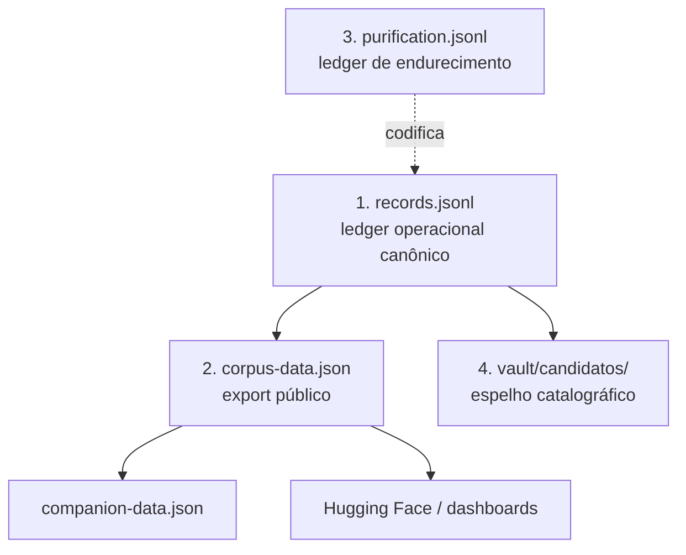

# Hierarquia de Dados — MOC

A ordem **canônica de fonte-da-verdade**. Quem deriva de quem.



| Ordem | Arquivo | Papel | ADR |
| --- | --- | --- | --- |
| 1 | [`records.jsonl`](../data/processed/records.jsonl) | ledger operacional canônico | [ADR-003](../docs/adr/003-jsonl-as-canonical.md) |
| 2 | [`corpus-data.json`](../corpus/corpus-data.json) | export público | [ADR-005](../docs/adr/005-github-and-hf-release-surfaces.md) |
| 3 | [`purification.jsonl`](../data/processed/purification.jsonl) | ledger de [[Endurecimento]] | [decisão N](../docs/decisions/DIALETICA-N165-vs-265.md) |
| 4 | `vault/candidatos/` | espelho catalográfico auxiliar | [ADR-004](../docs/adr/004-vault-as-index.md) |

## Contagens atuais

> [!info] As contagens vivem na fonte, não neste grafo
> Os números derivam a cada sync — fixá-los aqui só geraria drift. Para o estado
> corrente, consulte sempre:
> - **Documentado** (com data da última auditoria): [`../CLAUDE.md`](../CLAUDE.md) §*Known Data Issues*.
> - **Ao vivo:** `python tools/scripts/validate_schemas.py` (validade de `records.jsonl`)
>   e `python tools/scripts/records_to_corpus.py --diff` (drift records → corpus).

## Regra de rastreabilidade

Todo item existe em **três lugares**: Google Drive + `drive-manifest.json`
([ADR-001](../docs/adr/001-drive-as-raw-store.md)) · `vault/candidatos/` ·
`records.jsonl`.

## Reconciliação

```bash
python tools/scripts/records_to_corpus.py --diff          # preview drift records→corpus
python tools/scripts/sync_companion.py --output corpus/companion-data.json
python tools/scripts/validate_schemas.py                  # valida records.jsonl
```

## Conexões

- estrutura validada por: [[Esquemas JSON]]
- parâmetros do conteúdo: [[Parâmetros do Corpus]]
- governança: [[ADRs e Decisões — MOC]]
