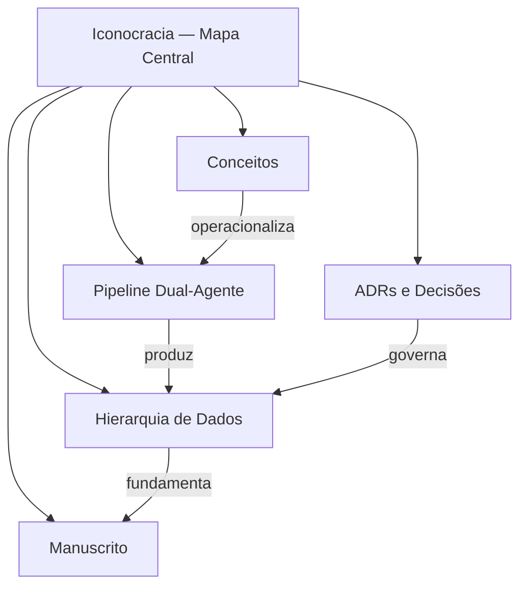

# Iconocracia — Mapa Central

Hub raiz do [[README|knowledge graph]] da tese **ICONOCRACIA: Alegoria Feminina
na História da Cultura Jurídica (Séculos XIX–XX)** (PPGD/UFSC, defesa 2026).
A partir daqui chega-se a qualquer nó em no máximo dois saltos.

> [!info] Tese em uma frase
> Como a alegoria feminina foi mobilizada, **purificada** e **endurecida** para
> personificar o Estado e o Direito entre 1800 e 2000 — e como mensurar essa
> operação num corpus de imagens jurídico-políticas.

## Os quatro eixos do grafo

## 1. Conceitos → [[Conceitos — MOC]]

A espinha teórica autoral. Os quatro conceitos originais da tese:

- [[Purificação Clássica]] — conceito #4, a operação-matriz
- [[Endurecimento]] — operacionalização empírica da Purificação (10 indicadores 0–3)
- [[Contrato Sexual Visual]] — conceito #1
- [[Contrato Racial Visual]] — conceito #3
- [[Feminilidade de Estado]] — conceito #2
- [[Regimes Iconocráticos]] — FUNDACIONAL → NORMATIVO → MILITAR → CONTRA-ALEGORIA
- [[Vocabulário Warburguiano]] — *Pathosformel*, *Nachleben*, *Zwischenraum*

## 2. Pipeline → [[Pipeline Dual-Agente — MOC]]

Como as imagens entram e são analisadas:

- [[WebScout]] (descoberta em arquivos digitais) → [[IconoCode]] (Panofsky + endurecimento)
- Orquestração de aquisição via ARGOS

## 3. Dados → [[Hierarquia de Dados — MOC]]

A cadeia canônica de fontes-da-verdade:

- [[Esquemas JSON]] — 7 esquemas que validam tudo
- [[Parâmetros do Corpus]] — países, suportes, período, critérios de inclusão

## 4. Decisões → [[ADRs e Decisões — MOC]]

As 6 ADRs + a dialética metodológica do **N analítico** (estratos de codificação).

## 5. Manuscrito → [[Manuscrito — MOC]]

Os capítulos em [`../tese/manuscrito/`](../tese/manuscrito/) e onde cada conceito é desenvolvido.

## Cobertura exaustiva → [[Stubs — Índice]]

Além da espinha curada acima, os **nós-stub** auto-gerados dão cobertura
exaustiva às superfícies documentais (ADRs, decisões, esquemas, capítulos,
conceitos, docs, notebooks) — a contagem corrente fica em [[Stubs — Índice]].
Regenerar: `python atlas/_generate_stubs.py`.

---

> [!note] Estado do corpus
> As contagens (`records.jsonl`, `corpus-data.json`, codificados) variam a cada
> sync — este grafo não as fixa. Para os números atuais, ver
> [[Hierarquia de Dados — MOC]] e [`../CLAUDE.md`](../CLAUDE.md) §*Known Data Issues*.
