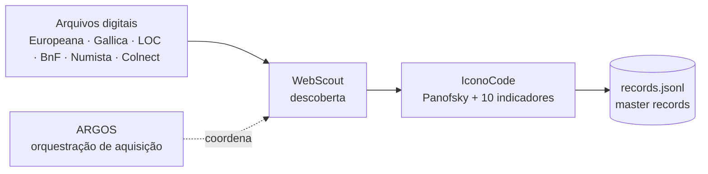

# Pipeline Dual-Agente — MOC

Como uma imagem entra no corpus e vira um **master record**.



## Etapas

1. **[[WebScout]]** — descoberta em arquivos digitais → `webscout-output`.
2. **[[IconoCode]]** — análise visual em 3 níveis Panofsky + 10 indicadores de
   [[Endurecimento]] → `iconocode-output`.
3. **Saída** → [[Hierarquia de Dados — MOC|records.jsonl]] (canônico).

## ARGOS — orquestração de aquisição

Workflow que constrói o **manifesto** de aquisição pendente e deriva grupos de
despacho. Trigger `argos`. Comandos:

```bash
python tools/scripts/argos_build_manifest.py
python tools/scripts/argos_prepare_dispatch.py --manifest data/raw/argos/manifest.json
python tools/scripts/argos_report.py
```

- Esquema: [[Esquemas JSON|argos-manifest.schema.json]]
- Runbook: [`../docs/ARGOS_RUNBOOK.md`](../docs/ARGOS_RUNBOOK.md)

## Fontes

- Visão geral: [dual-agent-corpus-builder](../docs/dual-agent-corpus-builder.md) · [WORKFLOW](../docs/WORKFLOW.md)
- Metodologia: [methodology](../docs/methodology.md)

> [!note] Implementação espelhada (Iuris Visio)
> A runtime do pipeline é reimplementada em TypeScript/Cloudflare Workers no
> repositório irmão **iuris-visio-roadmap** (Durable Objects: WebScout, IconoCode).
