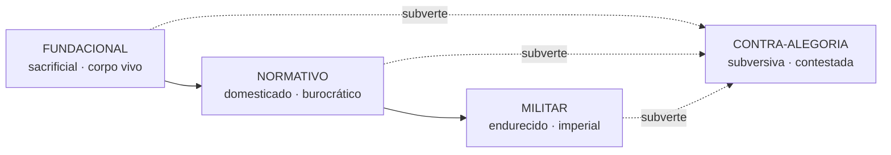

# Regimes Iconocráticos

Tipologia **diacrônica** dos modos de existência da alegoria feminina jurídica.
Cada regime é um perfil característico de [[Endurecimento]].

| Regime | Corpo | Tom | Endurecimento típico |
| --- | --- | --- | --- |
| **FUNDACIONAL** | vivo, sacrificial | revolucionário | baixo |
| **NORMATIVO** | domesticado | burocrático | médio |
| **MILITAR** | endurecido | imperial | alto + serial |
| **CONTRA-ALEGORIA** | reapropriado | subversivo/contestado | indicadores invertidos |

> [!note] Quarto regime epistêmico
> A **CONTRA-ALEGORIA** não é uma fase cronológica, mas um regime *epistêmico*
> transversal — a imagem que recusa ou inverte a purificação. Ver
> [anexo-m5](../docs/anexo-m5-quarto-regime-epistemico.md) e a flag
> `#contra-alegoria`.

## No dado

- Campo `regime` em [`../corpus/corpus-data.json`](../corpus/corpus-data.json):
  parte dos itens classificada, parte sem `regime` (cobertura **parcial** — ver
  [[Endurecimento]] e [[ADRs e Decisões — MOC]]).
- Tags de vault: `regime/fundacional`, `regime/normativo`, `regime/militar`.

## Conexões

- derivado de: [[Endurecimento]] (perfil dos 10 indicadores)
- incide sobre: [[Feminilidade de Estado]]
