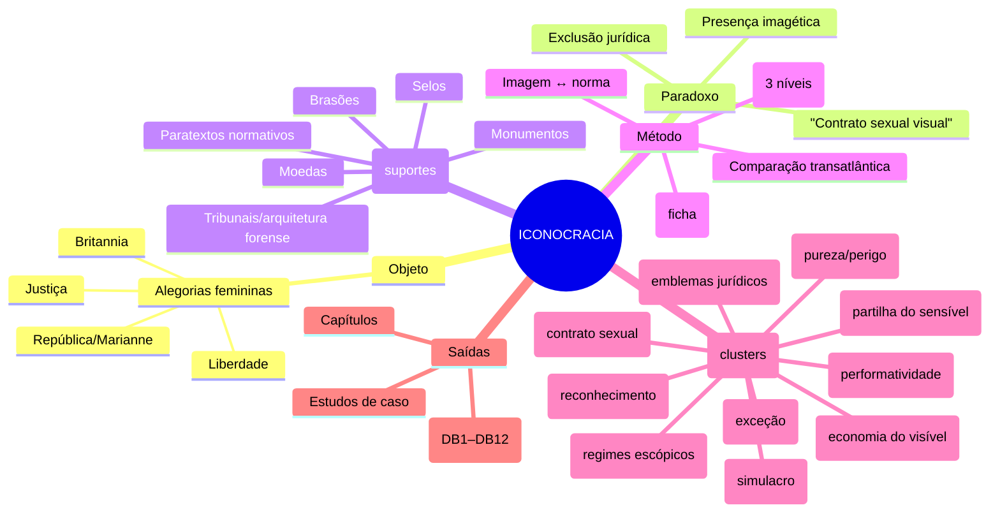
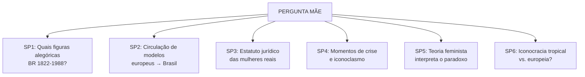
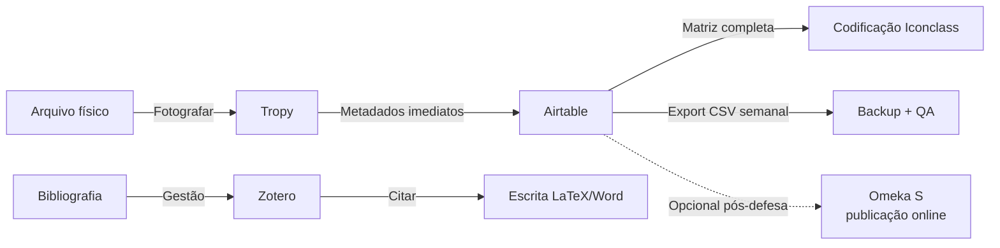
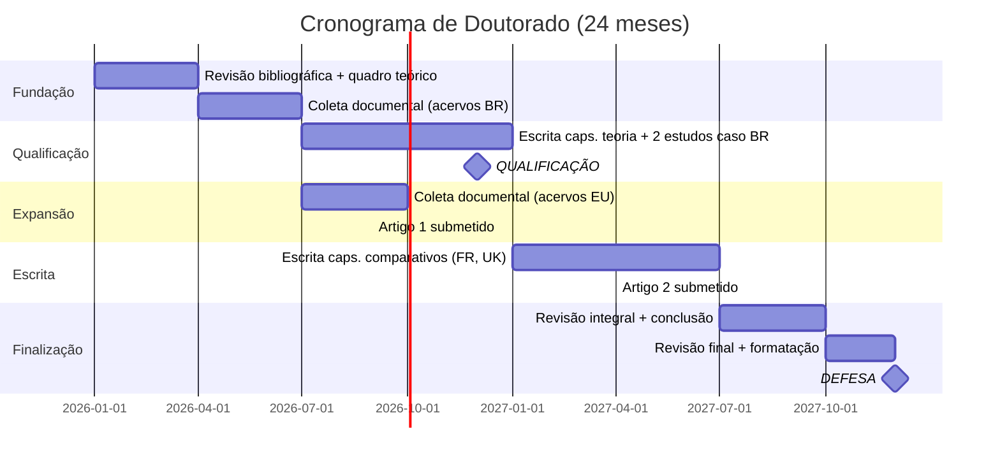

# Diagramas Mermaid — ICONOCRACIA

Diagramas para colar no Notion/Obsidian (blocos de código Mermaid).

## 1. Diagrama Principal (flowchart)

```mermaid
flowchart TB
	A["Problema central<br>Presença alegórica feminina (Estado/Direito)<br>vs exclusão jurídica das mulheres reais"] --> B["Hipótese operacional<br>Regime iconocrático = tecnologia visual de legitimidade"]
	B --> C["Mecanismos"]
	B --> D["Dispositivos (suportes)"]
	B --> E["Eixos empíricos (o que medir/codificar)"]
	B --> F["Estratégia comparativa"]

	C --> C1["Simulacro<br>feminilidade estatal como efeito de circulação"]
	C --> C2["Purificação do corpo alegórico<br>idealização, assepsia, desmaterialização"]
	C --> C3["Reativação em crise/exceção<br>intensificação e deslocamentos formais"]

	D --> D1["Moedas e cédulas<br>ubiquidade íntima / repetição serial"]
	D --> D2["Selos e emblemas<br>circulação material do Estado"]
	D --> D3["Brasões e frontispícios normativos<br>autoridade simbólica"]
	D --> D4["Monumentos<br>verticalidade / permanência / pedagogia cívica"]
	D --> D5["Arquitetura forense e tribunais<br>teatralidade ritual do Direito"]

	E --> E1["Panofsky (3 níveis)<br>descrição / identificação / interpretação"]
	E --> E2["Ficha de codificação<br>suporte, atributos, postura, inscrição, local"]
	E --> E3["Regimes escópicos por suporte<br>ubíquo | monumental | ritual"]
	E --> E4["Evidência do paradoxo<br>reconhecimento simbólico sem reciprocidade política"]
	E --> E5["Imagem↔norma<br>vínculo com dispositivos legais coetâneos"]

	F --> F1["Caso-âncora: Brasil<br>República + Justiça nos espaços judiciais"]
	F --> F2["Contrastes: França (Marianne) | Reino Unido (Britannia)"]
	F --> F3["Conjunturas<br>guerras, rupturas institucionais, estados de exceção"]
```

## 2. Diagrama-Índice (mindmap)

## 3. Subperguntas (graph)

## 4. Stack Tecnológico (flowchart)

## 5. Cronograma (gantt)

