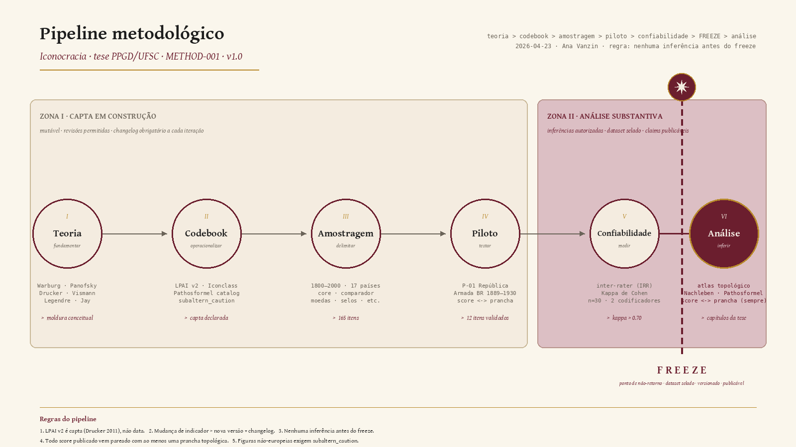

# Metodologia — Cartografia Warburguiana do Imaginário Jurídico

> Espelhamento público (para o repositório-backbone) da nota `METHOD-001 · Atlas, não Score`, trabalhada localmente no vault da tese. Esta versão técnica expõe o compromisso metodológico do projeto e as decisões em aberto; o debate conceitual permanece no vault e no documento para orientação PPGD/UFSC.

| Campo | Valor |
|---|---|
| Nota-fonte (vault) | `METHOD-001` |
| Status | Rascunho metodológico · em discussão com orientação |
| Escopo core | Brasil, 1800–2000 |
| Comparadores | Europa e Estados Unidos (peso ponderado, nunca equivalente) |
| Data | 2026-04-23 |
| Autora | Ana Vanzin — PhD, PPGD/UFSC |

## 0. Pipeline metodológico (visão sinótica)

> Versão animada: [`docs/assets/pipeline-methodology.gif`](./assets/pipeline-methodology.gif) · Versão vetorial: [`docs/assets/pipeline-methodology.svg`](./assets/pipeline-methodology.svg)

O pipeline obedece à disciplina `teoria → codebook → amostragem → piloto → confiabilidade → freeze → análise`. A barreira **FREEZE** é inegociável: **nenhuma inferência substantiva é proposta antes do congelamento do dataset**. Mudança de indicador após o freeze exige nova versão do codebook e entrada correspondente no changelog.

## 1. Problema metodológico

Como arranjar o corpus de alegorias femininas em dispositivos jurídico-estatais (moedas, selos, brasões, monumentos, arquitetura forense, paratextos normativos, 1800–2000) **de modo que o arranjo seja, ele próprio, argumento — e não ilustração**?

Duas alternativas concretas estão em disputa:

1. **LPAI (Legal-Political Allegory Index)** — codebook ordinal que pontua cada imagem em eixos pré-definidos (militarização, nudez alegórica, insígnia jurídica, *embodiment* de gênero). Produz tabela, estatística, ranking. Já operacionalizado: ver [T4 LPAI Ingest Report](./T4-LPAI-INGEST-REPORT.md) (15 fichas SCOUT BR+FR ingeridas em 2026-04-19) e [`tools/schemas/master-record.schema.json`](../tools/schemas/master-record.schema.json).
2. **Atlas-topológico** — arranjo em pranchas à la Warburg (*Bilderatlas Mnemosyne*, 1924–1929) que vizinha imagens por *Pathosformel*, *Nachleben*, ruptura ou *Zwischenraum*, sem hierarquia linear.

A questão não é estilística. É epistemológica: o LPAI, ao pontuar, **produz** uma verdade que afirma apenas **descrever**. Nessa dobradiça mora o risco de a tese reproduzir, no próprio método, o gesto iconocrático que pretende analisar.

## 2. Argumento metodológico

A hipótese do **regime iconocrático** exige uma **cartografia warburguiana do imaginário jurídico**. Tríade articulada, três camadas irredutíveis:

| Camada | Tradição | Operação sobre o corpus |
|---|---|---|
| (a) Arqueologia diacrônica do *dispositif* jurídico | Warburg × Foucault (via Didi-Huberman) | *Nachleben* da alegoria através de rupturas legais |
| (b) Mapeamento do campo de visão jurídica | Bourdieu × Artl@s × cartografia feminista | Quem encomenda, valida e reproduz Justitia, e em que posição no campo |
| (c) Atlas como modelo curatorial da tese | Pollock, *Virtual Feminist Museum* | A própria tese como atlas feminista, contra-canônico |

### Recomendação operacional

1. **Não descartar o LPAI.** Reenquadrá-lo como *capta* (Drucker, 2011) — leitura construída, parcial, situada — e usá-lo como ferramenta de **descoberta de corpus** e **documentação de ausência**. Exemplo: «nenhuma Justitia negra ou indígena nos palácios brasileiros» torna-se achado quantificável. Ver especificação completa em [`schema/lpai-v2-as-capta.md`](../schema/lpai-v2-as-capta.md).
2. **Adotar o atlas-topológico como estrutura de argumento.** As vizinhanças de prancha fazem o trabalho que o score não consegue: expõem *Pathosformeln*, ruptura, iconoclasmo e sobrevivência sem impor teleologia. Ver prancha-piloto em [`docs/pilots/P01-republica-armada.md`](./pilots/P01-republica-armada.md).
3. **Usar Iconclass** como camada de interoperabilidade (códigos 11M31 Justitia, 44G411 República feminina, 44G51 Liberdade) — única via de descoberta federada com ~50 bases linkadas, incluindo Erdteilallegorien e PHAROS.

## 3. Evidências (síntese de cinco correntes de pesquisa)

### 3.1 Warburg aplicado ao direito — campo quase vazio

- **STRAMIGNONI (2024)**, *Law and Critique* — único artigo em língua inglesa que mobiliza explicitamente *Pathosformel* na teoria da imagem jurídica.
- **HAYAERT (2020)**, *Lawful Lies: Veiled Justice in Early Modern Europe* (Edinburgh UP) — executa anatomia warburguiana de Justitia sem nomear Warburg.
- **BECKER (2013)**, *Journal of Art Historiography* n. 9 — aplica *Pathosformel* a Germania e à alegoria cívica.
- **RESNIK; CURTIS (2011)**, *Representing Justice* (Yale UP) — achado empírico decisivo: em milhares de tribunais auditados globalmente, apenas **um** (St. Croix, 1993) representa Justitia como mulher não branca.

→ Lacuna estrutural: nenhum trabalho combina Warburg, direito, feminismo e América Latina. A tese ocupa esse vácuo.

### 3.2 Não existe atlas digital dedicado a alegorias femininas no direito

- O **NCRD (Netherlands Center for Legal Iconography Documentation)** — única base dedicada à iconografia jurídica — **encerrou em dezembro de 2021**.
- Modelo formal mais próximo: **Engramma — Mnemosyne Atlas** (63 pranchas, 14 rotas temáticas, links cruzados).
- Modelo estrutural mais próximo para alegoria feminina: **Erdteilallegorien** (Viena): 407+ figuras, GIS, timeline, Iconclass completo, código aberto.
- Brasil: Brasiliana Iconográfica, BNDigital (3M+ documentos, OCR), IMS Acervo, Arquivo Nacional, Cartografia do Brasil — BNP.

→ A tese não preenche lacuna — nomeia e constrói o campo.

### 3.3 Crítica feminista e pós-colonial ao score é cumulativa e dura

- **MERRY (2016)**, *The Seductions of Quantification* — indicadores jurídicos *produzem* verdade em vez de revelá-la.
- **HARAWAY (1988)**, "Situated Knowledges" — o «truque-deus» do índice que pretende ver tudo de lugar nenhum.
- **DRUCKER (2011)**, *Digital Humanities Quarterly* — *«all data is capta»*; visualização padrão é *«anathema to humanistic thought»*.
- **ESPELAND; SAUDER (2007)**, *American Journal of Sociology* — reatividade: um índice disciplina os dados futuros em direção ao que «pontua bem». Previsão: um LPAI adotado começa a enviesar a própria seleção do corpus.
- **WARNER (1985)**, *Monuments and Maidens* — alegoria feminina é **constitutivamente paradoxal**: corpo genérico que encarna a lei da qual as mulheres foram excluídas. Nenhum score suporta a contradição; um atlas pode justapor emblema e exclusão.
- **DIDI-HUBERMAN (2002)**, *L'image survivante* — imagens são policrônicas; qualquer eixo único produz má-leitura sistemática.

### 3.4 Militarização da alegoria feminina segue padrão contra-intuitivo

| País | Período | Figura | Atributos militares ganhos |
|---|---|---|---|
| França | 1789–1914 | Marianne | gládio, fúsil, barrete frígio militarizado |
| Alemanha | 1848–1918 | Germania | *Reichsschwert*, couraça, *Pickelhaube* |
| Reino Unido / EUA | séc. XIX | Britannia / Columbia | capacete, tridente, corpo blindado sobre territórios colonizados |
| Brasil | 1889–1910 | República | espada, górgona — modo defensivo-reativo |
| Brasil (Estado Novo) | 1937–1945 | Pátria / República | **deslocamento** — culto personalista de Vargas desloca a alegoria armada |

**Padrão estrutural**: a militarização intensifica-se sob (a) ruptura republicana, (b) ameaça militar externa, (c) expansão imperial. **Atenua-se ou desloca-se** sob autoritarismo personalista — porque a figura armada feminina carrega conotações democrático-revolucionárias incompatíveis com a pessoalização do poder. A **iconocracia tropical** do Estado Novo prefere a mãe-Pátria doméstica à República armada.

### 3.5 Dobradiça metodológica: Didi-Huberman + Pollock

- **DIDI-HUBERMAN (2011)**, *Atlas, ou le gai savoir inquiet* — articulação explícita entre *Nachleben* warburguiano e arqueologia foucaultiana.
- **POLLOCK** — *Virtual Feminist Museum*: único precedente que operacionaliza o atlas warburguiano como **dispositivo curatorial feminista contra-canônico**.
- **ANDERMANN**, *The Optic of the State: Visuality and Power in Argentina and Brazil* — alegoria feminina na América Latina carrega carga política específica: nação feminizada como *patria/justicia* enquanto mulheres reais são excluídas do sujeito jurídico.

## 4. Lacunas e riscos

### Lacunas conceituais que a tese pode preencher
- Nenhum estudo combina Warburg + direito + feminismo + América Latina com corpus sistemático.
- A iconografia jurídica brasileira não está atlasificada — apenas catalogada dispersamente.
- A categoria **iconoclasmo / conflito de imagens** raramente é cruzada com alegoria feminina em contextos jurídico-estatais pós-coloniais — hipótese de **iconocracia/iconoclasmo tropical** permanece aberta.
- A conversão *capta* ↔ atlas, com o LPAI reenquadrado como ferramenta de descoberta, não foi executada em nenhum projeto conhecido.

### Riscos metodológicos a vigiar
- **Presentismo** — ler alegorias oitocentistas com gramática feminista contemporânea sem marcar a operação.
- **Comparação forçada** — equiparar Marianne e República brasileira sem registrar diferença de instalação institucional e «comunidade de imaginação» (Carvalho).
- **Instabilidade terminológica** — manter vocabulário estável: *iconocracia*, *regime iconocrático*, *feminilidade de Estado*, *reconhecimento sem reciprocidade*, *iconoclasmo*, *purificação simbólica*.
- **Alargamento de escopo** — Europa e EUA são **comparador**, não core. Fixar Brasil 1800–2000 como eixo.

## 5. Próximos passos

### Imediatos
- [ ] Congelar pipeline antes de qualquer inferência: teoria → codebook → amostragem → piloto → confiabilidade → **freeze** → análise.
- [ ] Decidir formalmente o destino do LPAI: (a) descartar, (b) reenquadrar como *capta* (recomendado), (c) manter pontuado com changelog explícito.
- [ ] Abrir capítulo metodológico da tese com esta tríade (arqueologia + campo + atlas) como fio condutor.

### Corpus e piloto
- [ ] Piloto de 10 pranchas warburguianas do corpus Brasil (República Lopes Rodrigues 1896; Sansebastiano Belém 1897; selos postais 1890–1930; moedas republicanas; paratextos da Constituição 1891; tribunais; monumentos vandalizados). Primeira prancha entregue: [`docs/pilots/P01-republica-armada.md`](./pilots/P01-republica-armada.md).
- [ ] Cada prancha: 6–12 imagens, legenda com *Pathosformel* dominante, marca de *Nachleben* e registro de iconoclasmo.
- [ ] Medir cobertura do corpus contra a lacuna Resnik-Curtis: documentar ausência de Justitia negra/indígena em tribunais brasileiros como achado quantificável.

### Leituras prioritárias para ancorar o capítulo
1. DIDI-HUBERMAN, Georges. *Atlas, ou le gai savoir inquiet*. Paris: Minuit, 2011.
2. POLLOCK, Griselda. *Differencing the Canon: Feminist Desire and the Writing of Art's Histories*. London: Routledge, 1999.
3. RESNIK, Judith; CURTIS, Dennis. *Representing Justice*. New Haven: Yale UP, 2011.
4. CARVALHO, José Murilo de. *A Formação das Almas: o imaginário da República no Brasil*. São Paulo: Companhia das Letras, 1990.
5. MERRY, Sally Engle. *The Seductions of Quantification*. Chicago: Chicago UP, 2016.
6. WARNER, Marina. *Monuments and Maidens*. London: Weidenfeld & Nicolson, 1985.
7. AGULHON, Maurice. *Marianne into Battle*. Cambridge: Cambridge UP, 1981.
8. WENK, Silke. *Versteinerte Weiblichkeit*. Köln: Böhlau, 1996.

## 6. Referências (seleção ABNT NBR 6023:2025)

AGULHON, Maurice. *Marianne into Battle: Republican Imagery and Symbolism in France, 1789–1880*. Cambridge: Cambridge University Press, 1981.

AGAMBEN, Giorgio. *Potentialities: Collected Essays in Philosophy*. Tradução: Daniel Heller-Roazen. Stanford: Stanford University Press, 1999.

ANDERMANN, Jens. *The Optic of the State: Visuality and Power in Argentina and Brazil*. Pittsburgh: University of Pittsburgh Press, 2007.

AZOULAY, Ariella Aïsha. *Potential History: Unlearning Imperialism*. London: Verso, 2019.

BARAD, Karen. *Meeting the Universe Halfway: Quantum Physics and the Entanglement of Matter and Meaning*. Durham: Duke University Press, 2007.

BAKHTIN, Mikhail. *Estética da criação verbal*. Tradução: Paulo Bezerra. São Paulo: Martins Fontes, 1986.

BECKER, Colleen. Aby Warburg's Pathosformel as methodological paradigm. *Journal of Art Historiography*, n. 9, 2013. Disponível em: <https://arthistoriography.wordpress.com/9-dec13/>.

CARNEIRO, Sueli. A construção do outro como não-ser como fundamento do ser. 2005. Tese (Doutorado em Filosofia) — Universidade de São Paulo, São Paulo, 2005.

CARVALHO, José Murilo de. *A Formação das Almas: o imaginário da República no Brasil*. São Paulo: Companhia das Letras, 1990.

DIDI-HUBERMAN, Georges. *L'image survivante: Histoire de l'art et temps des fantômes selon Aby Warburg*. Paris: Éditions de Minuit, 2002.

DIDI-HUBERMAN, Georges. *Atlas, ou le gai savoir inquiet: L'œil de l'histoire, 3*. Paris: Éditions de Minuit, 2011.

D'IGNAZIO, Catherine; KLEIN, Lauren. *Data Feminism*. Cambridge, MA: MIT Press, 2020. DOI: 10.7551/mitpress/11805.001.0001.

DRUCKER, Johanna. Humanities Approaches to Graphical Display. *Digital Humanities Quarterly*, v. 5, n. 1, 2011. Disponível em: <http://www.digitalhumanities.org/dhq/vol/5/1/000091/000091.html>.

DRUCKER, Johanna. *Graphesis: Visual Forms of Knowledge Production*. Cambridge, MA: Harvard University Press, 2014.

ESPELAND, Wendy Nelson; SAUDER, Michael. Rankings and reactivity: how public measures recreate social worlds. *American Journal of Sociology*, v. 113, n. 1, p. 1–40, 2007.

FANON, Frantz. *Peau noire, masques blancs*. Paris: Seuil, 1952.

FRASER, Nancy. *Justice Interruptus: Critical Realms and the Politics of Redistribution*. New York: Routledge, 1997.

FRASER, Nancy. From redistribution to recognition? Dilemmas of justice in a 'postsocialist' age. *New Left Review*, n. 212, p. 68–93, 2003.

GLISSANT, Édouard. *Poétique de la Relation*. Paris: Gallimard, 1990.

HARAWAY, Donna. Situated Knowledges: The Science Question in Feminism and the Privilege of Partial Perspective. *Feminist Studies*, v. 14, n. 3, p. 575–599, 1988.

HARTMAN, Saidiya. Venus in Two Acts. *Small Axe*, v. 12, n. 2, p. 1–14, 2008.

HAYAERT, Valérie. *Lawful Lies: Veiled Justice in Early Modern Europe*. Edinburgh: Edinburgh University Press, 2020.

JAY, Martin. Must Justice Be Blind? The Challenge of Images to the Law. *Filozofski Vestnik*, v. 17, n. 2, p. 65–81, 1996. Republicado em: DOUZINAS, C.; NEAD, L. (orgs.). *Law and the Image*. Chicago: University of Chicago Press, 1999. p. 19–35.

JOHNSON, Christopher D. *Memory, Metaphor, and Aby Warburg's Atlas of Images*. Ithaca, NY: Cornell University Press / Cornell University Library, 2012. (Signale: Modern German Letters, Cultures and Thought). 286 p. ISBN 978-0-8014-7742-3.

KILOMBA, Grada. *Plantation Memories: Episodes of Everyday Racism*. Münster: Unrast, 2008.

KRENAK, Ailton. *Ideias para adiar o fim do mundo*. São Paulo: Companhia das Letras, 2019.

LEGENDRE, Pierre. *Dieu au miroir: étude sur l'institution des images*. Paris: Fayard, 1994. (Leçons III). 348 p. ISBN 978-2-213-03185-9.

LUGONES, María. Heterosexualism and the colonial/modern gender system. *Hypatia*, v. 22, n. 1, p. 186–209, 2007.

MBEMBE, Achille. The Power of the Archive and its Limits. In: HAMILTON, Carolyn *et al.* (orgs.). *Refiguring the Archive*. Dordrecht: Kluwer, 2002. p. 19–26.

MERRY, Sally Engle. *The Seductions of Quantification: Measuring Human Rights, Gender Violence, and Sex Trafficking*. Chicago: University of Chicago Press, 2016.

MOSSE, George L. *Nationalism and Sexuality: Respectability and Abnormal Sexuality in Modern Europe*. New York: Howard Fertig, 1985.

NASCIMENTO, Beatriz. *Uma história feita por mãos negras*. Rio de Janeiro: Zahar, 2021.

PELUSO, Nancy Lee. Women's Output: Gender and the Political Ecology of Resource Management in Indonesia. In: GUILLETTE, Elizabeth; ROCHFORD, Thomas (orgs.). *Feminist Political Ecology*. New York: Routledge, 1995.

POLLOCK, Griselda. *Differencing the Canon: Feminist Desire and the Writing of Art's Histories*. London: Routledge, 1999.

QUIJANO, Aníbal. Colonialidad del poder, eurocentrismo y América Latina. In: LANDER, Edgardo (org.). *La colonialidad del saber: eurocentrismo y ciencias sociales*. Buenos Aires: CLACSO, 2000. p. 201–246.

RANCIÈRE, Jacques. *The Politics of the Aesthetics*. Tradução: Gabriel Rockhill. London: Continuum, 2004.

RESNIK, Judith; CURTIS, Dennis. *Representing Justice: Invention, Controversy, and Rights in City-States and Democratic Courtrooms*. New Haven: Yale University Press, 2011.

SEGATO, Rita Laura. *La guerra contra las mujeres*. Madrid: Traficantes de Sueños, 2016.

SHERWIN, Richard K. *Visualizing Law in the Age of the Digital Baroque: Arabesques and Entanglements*. London: Routledge, 2011.

STAR, Susan Leigh; GRIESEMER, James R. Institutional ecology, 'translations' and boundary objects: amateurs and professionals in Berkeley's Museum of Vertebrate Zoology, 1907–39. *Social Studies of Science*, v. 19, n. 4, p. 387–420, 1989.

STOLER, Ann Laura. *Along the Archival Grain: Epistemic Anxieties and Colonial Common Sense*. Princeton: Princeton University Press, 2009.

STRAMIGNONI, Igor. [Artigo sobre Warburg e teoria da imagem jurídica]. *Law and Critique*, 2024. (DOI a confirmar na corrente `stream1_warburg_legal`).

VISMANN, Cornelia. *Medien der Rechtsprechung*. Frankfurt am Main: S. Fischer Verlag, 2011. 456 p. ISBN 978-3-10-400946-9 (e-book) / 978-3-596-37067-2 (ed. Taschenbuch 2019).

WARNER, Marina. *Monuments and Maidens: The Allegory of the Female Form*. London: Weidenfeld & Nicolson, 1985.

WENK, Silke. *Versteinerte Weiblichkeit: Allegorien in der Skulptur der Moderne*. Köln: Böhlau, 1996.

WERNECK, Jurema. Nossos passos vêm de longe! *Saúde e Direitos Reprodutivos*, v. 12, n. 1, p. 23–28, 2010.

---

## Status

Rascunho metodológico · **Anexo M.2 v6-reparada (com duplo lastro Norte+Sul) incorporated 2026-04-25** · aguardando discussão com orientação PPGD/UFSC. LPAI fate: reenquadrado como *capta* (schema/lpai-v2-as-capta.md). Direção 1 da recursão executada.

## Anexo M.2 — Seis condições de felicidade ilocucionária do Atlas, com duplo lastro Norte+Sul (α–ζ)

> **Nota.** Este anexo substitui a versão v5 (lastro exclusivamente norte-atlântico) pela versão v6-reparada, incorporando sustentadores do Sul que alteram substantivamente — não ornamentam — cada condição. A alteração foi exigida pelo Ataque 3 da auditora hostil (Fase 6, cycling dialético 1) e executada como Direção 1 da recursão. Síntese completa do ciclo 1 em [`docs/dialectic-cycle-1/07-sintese-final-v6.md`](./dialectic-cycle-1/07-sintese-final-v6.md).

### Preâmbulo: por que o duplo lastro não é ornamental

As seis condições foram formuladas originalmente com sustentadores do Norte (Barad, Star, Bakhtin, Peluso, Fraser, Rancière, Mondzain, Azoulay, Derrida) — autores que a tese mobiliza legitimamente. O Ataque 3 da Fase 6 demonstrou que uma teoria da *ativação-em-comum* em contexto brasileiro que ignora Fanon, Glissant, Quijano, Carneiro, Krenak, Segato, Kilomba, Lugones e Nascimento é, ela mesma, um ato de iconocracia teórica: importar ferramentas do regime que se pretende analisar, sem examinar de onde vêm e a quem serve essa importação.

A incorporação que se segue não adiciona referências decorativas. Cada sustentador do Sul *altera a condição* — torna-a mais rigorosa, mais específica ao objeto brasileiro, ou expõe uma dimensão que o sustentador do Norte não alcança sozinho. Onde não há alteração, isso é declarado.

### Coluna de sustentadores

|| # | Condição | Sustentador Norte | Sustentador Sul | Efeito da adição | Indicador auditável |
||---|---|---|---|---|---|
|| α | **Abertura estrutural** — difractiva e acessível | Barad 2007 (*diffraction*); Star & Griesemer 1989 (*boundary object*); Drucker 2014 (*capta*) | Glissant 1990 (*Poétique de la Relation*) | Barad define *diffraction* como padrão de diferenças *entre* trajetórias. Glissant define *opacity* como **direito de não ser transparente** — a opacidade não é falta de clareza; é recusa ativa de apresentar-se legível ao outro. Para o LPAI, isso muda o indicador: o "excedente interpretativo" não é dado que falta codificar; é ruído que o atlas se recusa a eliminar. A condição α exige que a grade não exija que as imagens falem — que ela tolere o que não se reduz a sentido transmissível | (i) grade LPAI v2 inclui campo "excedente interpretativo" explicitamente marcado como **não codificável**; (ii) licença CC-BY-SA com cláusula de não-exigência de transparência interpretativa; (iii) formato não-proprietário; (iv) API pública com rate-limit generoso para consultas parciais |
|| β | **Endereçamento explícito** | Bakhtin 1986 (*addressivity*); Azoulay 2019 (*Potential History*) | Krenak 2019 (*Ideias para adiar o fim do mundo*) | Bakhtin e Azoulay concebem comunidade como polo de recepção: alguém recebe a obra e a ativa. Krenak inverte a relação: comunidade não é interlocutora que o autor escolhe — é modo de existência que o Estado brasileiro colonial打扮e sistematicamente. *Endereçamento* em Krenak não é convite; é reconhecimento de que a comunidade nomeada existe *contra* a ordem que a tese estuda. A consequência operacional: a carta de endereçamento não pode ser listagem de disciplinas acadêmicas — precisa nomear comunidades concretas cuja existência é atravessada pela iconocracia que a tese denuncia | Carta de endereçamento no prefácio da tese nomeando: (a) movimentos feministas negros e indígenas — Geledés, Cfemea, Coordena das Mulheres Negras, Marcha Mundial das Mulheres; (b) conselhos de mulheres negras de tribunais — AJDUB, AMB; (c) coletivos de arquitetura forense antirracista — Laboratório de Narrativas Antropofágicas, grupos de patrimônio afro-brasileiro; (d) historiadoras do direito interessadas; (e)humanidades digitais críticas. Cada nome requiere carta de convite com explicação do que significa ser "endereçada" |
|| γ | **Transferência de ownership** | Peluso 1995; Radjawali *et al.* 2017 (*boundary work*) | Carneiro 2005 (*A construção do outro como não-ser*); Nascimento 2021 (*Uma história feita por mãos negras*) | Peluso/Radjawali tratam ownership como controle sobre recursos (ambientais). Carneiro_expande: *epistemicídio* é a destruição sistemática do que não-ser produz como sujeito de conhecimento. Nascimento complementa: a história das mãos negras é a história do que foi destruído do arquivo. A condição γ não é apenas "não proprietizar o corpus" — é reconhecer que o corpus contém **o que foi tomado**, e que devolver ownership exige mais do que abrir PRs: exige que comunidades endereçadas possam **modificar o que entra e o que não entra** — inclusive apagando | Repo público versionável; PRs aceitos com protocolo de resposta em 30 dias; não-proprietariedade do corpus (sem TM/MC sobre "LPAI"); documento de governança de dados nomeando quem pode remover itens — bukan sekadar edit; protocolo de "desarquivamento" para itens que comunidades solicitarem remoção |
|| δ | **Inscrição em demanda concreta** | Fraser 2003 (*counterpublics*); Leca & Barin Cruz 2021 | Fanon 1952 (*Peau noire, masques blancs*); Segato 2016 (*La guerra contra las mujeres*) | Fraser teoriza demandas de grupos subordinados dentro de ordens de reconhecimento já constituídas. Fanon_expõe o mecanismo mais fundo: o colonizado **interioriza o olhar do colonizador** — o problema da iconocracia não é apenas que o Estado use alegorias; é que mulheres negras e indígenas *interiorizaram* que não são subjects do direito que as representa. Segato complementa: a guerra contra as mulheres é guerra simbólica que precede a violência física — a alegoria jurídica éweapon dessa guerra. A consequência: δ não basta requerer "uso em disciplina"; exige que a demanda seja concretada com comunidades que *sofrem* a iconocracia, não apenas que a estudam | Três usos concretizados antes da defesa: (1) DIR410346 — disciplina com participação de representantes de movimentos feministas negros; (2) memorial técnico em processo de patrimônio contestado (identificar um processo concreto, e.g. tombamento de edificio com alegoria escravocrata); (3) colaboração formal com museu ou tribunal — não como "parceiro", mas como instância que pode recusar a codificação |
|| ε | **Nominação explícita do regime contestado** | Rancière 2004 (*partage du sensible*); Mondzain 2009 (*Image, icône, économie*) | Quijano 2000 (*colonialidad del poder*) | Rancière/Mondzain nomeiam o regime visual-jurídico como partição do visível. Quijano_expõe que essa partição é **racial**: "colonialidade do poder" é o padrão global de classificação racial que estructura quem é visível, quem representa e quem é representado. Iconocracia brasileira não é análoga à europeia — é o *mesmo* padrão colonial beroperasi di Amerika Latina dengan caratter racial específico. A consequência: ε não pode usar "iconocracia" como se fosse categoria neutra; o glossário deve declarar que o termo é atravessado por Quijano, que nomeia o regime racial-colonial que o sustenta | Glossário canônico fixo (iconocracia, regime iconocrático, feminilidade de Estado, reconhecimento sem reciprocidade, colonialidade do poder, epistemicídio); codebook versionado com changelog público; citação explícita de Quijano em todas as ocorrências de "colonial" no codebook; ABNT NBR 6023:2025 para todas as fontes |
|| ζ | **Inclusão reflexiva dos atos publicacionais — com declaração de insuficiência** | Azoulay 2019; Stoler 2009; Derrida 1995 | Kilomba 2008 (*Plantation Memories*) | Azoulay/Stoler/Derrida demonstram que a auto-reflexividade do arquivo é insuficiente — o arquivo colonial carrega violência constitutiva que a autoconsciência não neutraliza. Kilomba vai mais longe: em *Plantation Memories*, ela mostra que pessoas negras são ao mesmo tempo **sujeitos do arquivo** (presentes nas listas de escravizados) e **excluídas do arquivo** (as listas não contam sua perspectiva). O problema da condição ζ não é apenas que a tese codifique a si mesma — é que a grade LPAI que a tese usa foi produzida *por* alguém que a banca avalia. Kilomba exige: a condição ζ precisa incluir **testemunhas** — não apenas auto-codificação, mas pessoas atingidas que possam dizer se a codificação as violentou novamente | Itens 166–169 (diagrama pipeline, repo, dataset HF, Google Doc) no corpus; codificados pela grade LPAI v2; submetidos a leitura por testemunhas (mínimo 3) de comunidades endereçadas em β antes da publicação; relatório de testemunhas incluído como item 170; protocolo de "nova codificação após testemunho" documentado |

### Propriedade assimétrica (reafirmada)

As condições são falsificáveis num sentido (violá-las garante captura detectável) mas **não são verificáveis em efeito** (cumpri-las não garante contra-iconocracia). A síntese não promete emancipação; promete detectabilidade do fracasso.

**Assimetria em termos de lastro duplo:** a adição do Sul não remove a assimetria — ela a agudiza. Se Glissant tem razão, o excedente interpretativo de α é irredutível *por princípio*; se Carneiro/Nascimento têm razão, γ nunca pode ser plenamente "transferida" porque o que foi tomado não pode ser devolvido em repositórios. A detecção do fracasso permanece o único critério honesta.

### Três limites declarados (v6-reparada)

1. **Auditoria externa real não é opcional** — Anexo M.3 (Direção 2 da recursão, issue #38). Sem auditores com poder institucional de recusa, α–ζ são laudo pericial assinado pelo réu.
2. ~~Lastro teórico é do Norte; síntese é epistemicamente parcial~~ **(REPARADO NESTA VERSÃO)** — A Direção 1 da recursão foi executada. O duplo lastro Norte+Sul não fecha a lacuna (nenhuma tese fecha), mas a reduz e a declara com rigor. Permanecem parciais: a tese é escrita em português acadêmico, dentro do PPGD/UFSC, avaliada por banca brasileira — todas as condições de produção carregam геолокацию epistêmica que nenhuma bibliografia corrige.
3. **Forma-arquivo permanece tensão não resolvida** — Anexo M.4 (Direção 3 da recursão, issue #39). Taylor (archive vs. repertoire) não foi incorporada nesta versão; permanece como investigação em curso.
4. **O quarto regime epistémico permanece em aberto** — decisão editorial da introdução (Direção 4 da recursão, issue #40).

---

## Ligações internas

- [`docs/T4-LPAI-INGEST-REPORT.md`](./T4-LPAI-INGEST-REPORT.md) — estado operacional do LPAI v2 (15 fichas SCOUT BR+FR).
- [`schema/lpai-v2-as-capta.md`](../schema/lpai-v2-as-capta.md) — reenquadramento do LPAI como *capta* (Drucker).
- [`docs/pilots/P01-republica-armada.md`](./pilots/P01-republica-armada.md) — prancha-piloto com os operadores curatoriais aplicados.
- [`docs/dialectic-cycle-1/`](./dialectic-cycle-1/README.md) — ciclo dialético 1 · traço completo (Fases 1–7).
- [`docs/anexo-m3-protocolo-auditoria-externa.md`](./anexo-m3-protocolo-auditoria-externa.md) — **Anexo M.3** · protocolo de auditoria externa com poder real (Direção 2 da recursão, issue #38).
- [`docs/anexo-m4-archive-repertoire.md`](./anexo-m4-archive-repertoire.md) — **Anexo M.4** · forma-arquivo vs. repertoire — a grade é constitutivamente iconocrática? (Direção 3 da recursão, issue #39).
- [ADR-005 — GitHub canônico / HF público](./adr/005-github-and-hf-release-surfaces.md).
- [`README.md`](../README.md) — modelo operacional do monorepo.
