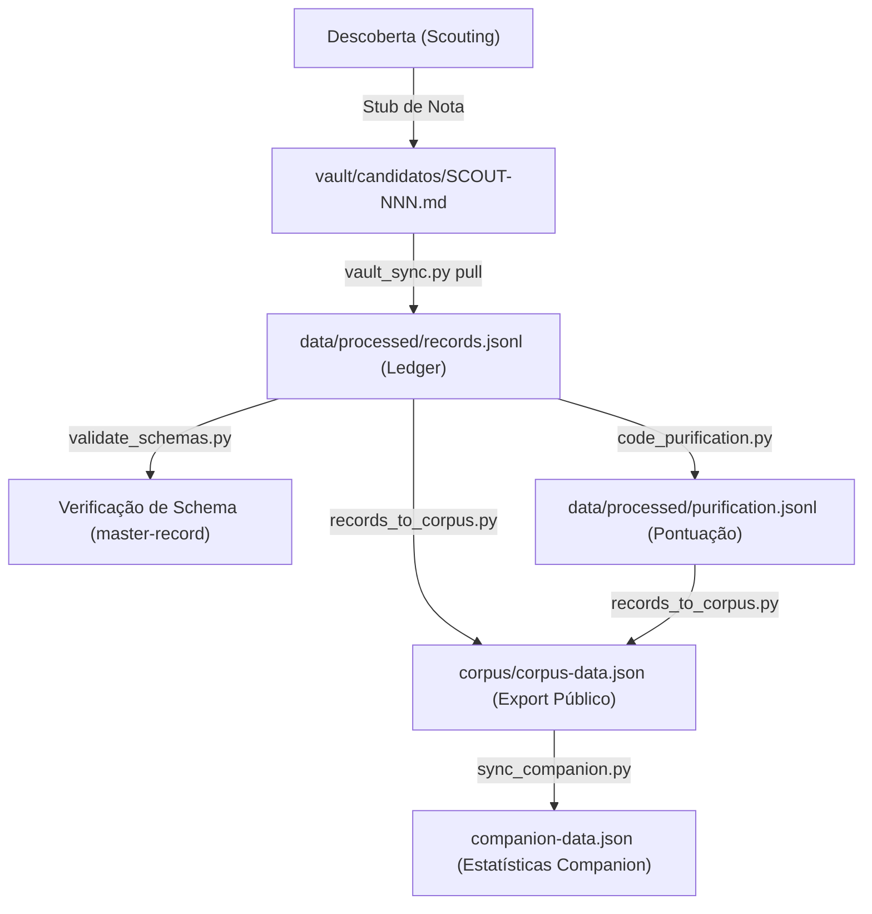

# RELATÓRIO DE AUDITORIA DE CONTEXTO DO REPOSITÓRIO (AUDIT CONTEXT REPORT)

**Projeto:** Iconocracia — Female Allegory in the History of Legal Culture (19th–20th c.)  
**Revisor:** Antigravity (Advanced Agentic Coding - Google DeepMind)  
**Data:** 2026-06-23  

---

## 1. ORIENTAÇÃO DO REPOSITÓRIO (DIRECTORY MAPPING)

O repositório está estruturado em subsistemas que separam o ledger de dados brutos (*capta*), a catalogação do vault Obsidian, as ferramentas automatizadas de codificação e a escrita dos manuscritos da tese.

| Módulo/Diretório | Papel e Responsabilidade | Arquivos Principais |
|------------------|--------------------------|---------------------|
| `corpus/` | Dados públicos e consolidados do corpus. | [corpus-data.json](file:///Users/ana/Research/hub/iconocracy-corpus/corpus/corpus-data.json) |
| `data/processed/` | Dados operacionais estruturados e ledger canônico. | [records.jsonl](file:///Users/ana/Research/hub/iconocracy-corpus/data/processed/records.jsonl), [purification.jsonl](file:///Users/ana/Research/hub/iconocracy-corpus/data/processed/purification.jsonl) |
| `vault/candidatos/` | Notas catalográficas em formato Obsidian (Markdown). | `SCOUT-*.md`, `BR-*.md` |
| `tools/schemas/` | Definições de esquema JSON para validação estrutural. | [master-record.schema.json](file:///Users/ana/Research/hub/iconocracy-corpus/tools/schemas/master-record.schema.json) |
| `tools/scripts/` | Ferramentas e rotinas automatizadas em Python. | [validate_schemas.py](file:///Users/ana/Research/hub/iconocracy-corpus/tools/scripts/validate_schemas.py), [records_to_corpus.py](file:///Users/ana/Research/hub/iconocracy-corpus/tools/scripts/records_to_corpus.py) |
| `docs/` | Guias de execução, roadmaps e relatórios de auditoria. | [WORKFLOW.md](file:///Users/ana/Research/hub/iconocracy-corpus/docs/WORKFLOW.md) |

---

## 2. ATORES DO SISTEMA E FLUXO DE PERMISSÕES

* **Pesquisadora (Ana)**: A autoridade final que toma as decisões conceituais, realiza a codificação manual de itens (via terminal ou Obsidian) e valida as interpretações.
* **Scout Agent**: Agente autônomo encarregado de buscar novas imagens e registrar stubs temporários (`SCOUT-*.md`).
* **Iconocode Agent**: Agente de visão computacional responsável por inferir códigos de classificação (ex.: Iconclass) e propor pontuações preliminares para os 10 indicadores de purificação.
* **Validadores/Agentes de Infraestrutura**: Scripts Python executados localmente para garantir a integridade dos esquemas e realizar a sincronização de dados.

---

## 3. ANÁLISE DE SCRIPTS CRÍTICOS (CODE AUDIT)

### 3.1 [validate_schemas.py](file:///Users/ana/Research/hub/iconocracy-corpus/tools/scripts/validate_schemas.py)
* **Objetivo**: Garantir que todos os arquivos de dados estejam estritamente em conformidade com seus respectivos esquemas JSON (Draft 2020-12).
* **Mecanismos Críticos**:
  * Carregamento centralizado de esquemas em `tools/schemas/` usando um `RefResolver` com o namespace `https://example.org/schemas/`.
  * Validador customizado `_collect_format_errors` para tratar desvios em campos do tipo `date-time` e `uri` que nem sempre são capturados uniformemente por bibliotecas jsonschema legadas.
* **Avaliação**: Extremamente estável. Funciona como barreira de segurança pré-commit.

### 3.2 [records_to_corpus.py](file:///Users/ana/Research/hub/iconocracy-corpus/tools/scripts/records_to_corpus.py)
* **Objetivo**: Exportar a fonte de verdade operacional (`records.jsonl`) para o arquivo estruturado final (`corpus-data.json`).
* **Mecanismos Críticos**:
  * Utiliza UUID5 com namespace estável `_NS` (`6ba7b810-9dad-11d1-80b4-00c04fd430c8`) para gerar IDs determinísticos.
  * Modo de mesclagem (`--merge`, padrão) que impede a perda de campos conceituais ricos adicionados manualmente ao `corpus-data.json` que não fazem parte do esquema master-record.
* **Avaliação**: O uso de escrita atômica (`_atomic_write_json`) por meio de arquivos temporários e substituição atômica previne a corrupção do corpus em caso de erros de encerramento de script.

### 3.3 [vault_sync.py](file:///Users/ana/Research/hub/iconocracy-corpus/tools/scripts/vault_sync.py)
* **Objetivo**: Sincronizar o ledger operacional (`records.jsonl`) com as notas físicas do vault do Obsidian (`vault/candidatos/`).
* **Mecanismos Críticos**:
  * Parser simples de YAML frontmatter (`_parse_frontmatter`) implementado sem dependências de pacotes externos.
  * O comando `pull` importa novos registros convertendo chaves do frontmatter em chaves do master-record, exigindo a presença de um ID do corpus ou uma URL de evidência ativa para evitar a entrada de itens puramente especulativos.
* **Avaliação**: O parser de frontmatter YAML embutido é linear e assume um formato estrito. Pode quebrar se houver chaves aninhadas complexas ou blocos multilinha de texto com aspas não escapadas.

### 3.4 [code_purification.py](file:///Users/ana/Research/hub/iconocracy-corpus/tools/scripts/code_purification.py)
* **Objetivo**: Interface de terminal para codificação humana (pesquisadora) dos 10 indicadores ordinais da escala de purificação e seleção do regime iconocrático.
* **Mecanismos Críticos**:
  * Computa a média dos 10 indicadores para gerar o `purificacao_composto`.
  * Exportação de dados consolidados para CSV (`corpus_dataset.csv`).
  * Geração de amostragem estratificada aleatória por regime para análise de confiabilidade inter-codificadores (IRR), gravando os resultados em `irr_sample.json`.
* **Avaliação**: Muito bem estruturado. A modularidade do carregamento de codificações (`load_coded`) em modos `latest`, `all` e `consensus` dá suporte robusto a auditorias futuras de codificação múltipla.

---

## 4. RECONSTRUÇÃO DO FLUXO DE TRÁFEGO DE DADOS

O ciclo de vida de uma representação alegórica segue a seguinte esteira:

---

## 5. FRAGILIDADES E RECOMENDAÇÕES DE INTEGRIDADE

1. **Vulnerabilidade do Parser de Frontmatter YAML**:
   * *Risco*: Modificações manuais nas notas do Obsidian usando estruturas YAML complexas (ex.: listas aninhadas ou aspas aninhadas) podem causar falhas silenciosas de leitura em `vault_sync.py`.
   * *Recomendação*: Substituir o parser artesanal de `vault_sync.py` pela biblioteca `PyYAML` ou adicionar testes de validação rígidos para o bloco de frontmatter antes da conversão.
2. **Drift de Dados em Exportações Manuais**:
   * *Risco*: Alterações feitas diretamente em `corpus-data.json` serão destruídas na execução do script de exportação com o parâmetro `--replace`.
   * *Recomendação*: Tratar o arquivo `records.jsonl` e as notas do vault como as únicas fontes de verdade. Qualquer correção textual ou alteração de atributos deve ser efetuada na nota Markdown correspondente ou via script de migração no ledger.
3. **Gerenciamento de Duplicatas (ID Mapping)**:
   * *Risco*: A geração de UUIDs baseada em títulos de notas pode criar colisões ou IDs duplicados se o título for renomeado no Obsidian antes do sincronismo.
   * *Recomendação*: Garantir que o script de sincronização registre o UUID gerado no próprio frontmatter da nota do Obsidian na primeira importação para evitar regenerações de IDs por alteração de nome do arquivo.
