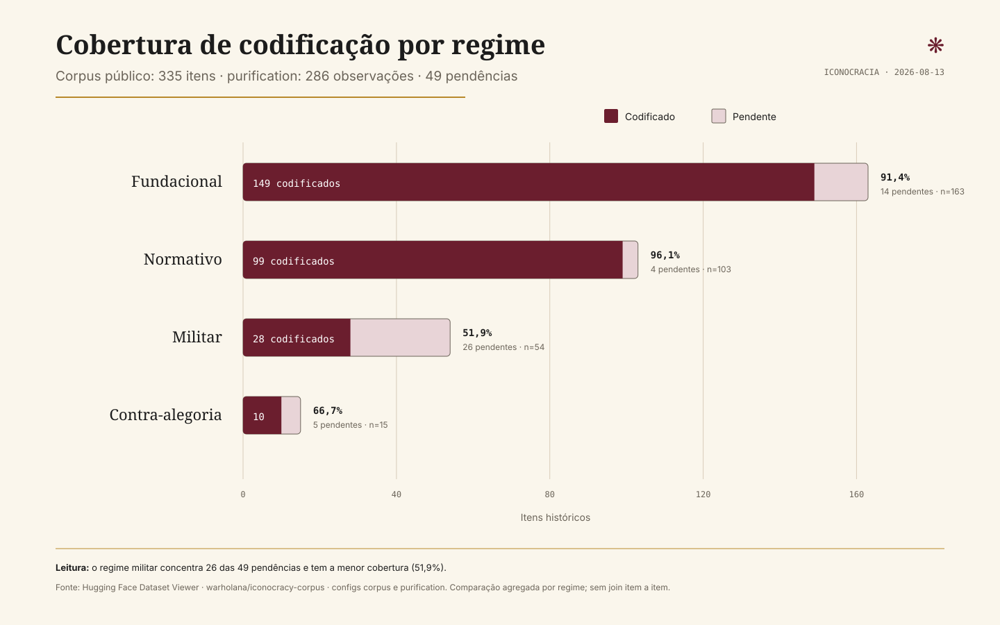

# Cobertura de codificação por regime iconocrático

Snapshot analítico do dataset público
[`warholana/iconocracy-corpus`](https://huggingface.co/datasets/warholana/iconocracy-corpus),
consultado em 13 de agosto de 2026.

## Pergunta analítica

Como os 49 itens ainda sem observação em `purification` se distribuem entre os
quatro regimes iconocráticos do corpus público?

## Resultado

| Regime | Total | Codificados | Pendentes | Cobertura |
| --- | ---: | ---: | ---: | ---: |
| Fundacional | 163 | 149 | 14 | 91,4% |
| Normativo | 103 | 99 | 4 | 96,1% |
| Militar | 54 | 28 | 26 | 51,9% |
| Contra-alegoria | 15 | 10 | 5 | 66,7% |
| **Total** | **335** | **286** | **49** | **85,4%** |

O regime militar concentra 26 dos 49 itens pendentes (53,1% da lacuna) e tem
a menor cobertura de codificação (51,9%). Ele é, portanto, a prioridade
quantitativa mais clara para a próxima campanha de codificação. Essa prioridade
não substitui adjudicação qualitativa nem implica que todos os itens militares
tenham o mesmo valor historiográfico.



## Proveniência e limite de inferência

A consulta usa os Parquets derivados pelo Dataset Viewer do Hugging Face:

- `corpus/train/0000.parquet`: 335 itens, agregados por `regime`;
- `purification/train/0000.parquet`: 286 observações, agregadas por
  `regime_iconocratico`.

Os namespaces de identidade não coincidem na superfície pública: `corpus.id`
usa UUIDs, enquanto `purification.id` ainda contém identificadores como
`AR-001`. Por isso, a análise compara contagens agregadas por regime e **não**
faz join item a item. O campo `pending_items` é uma diferença entre estratos,
não uma lista nominal de objetos pendentes.

## Reprodução

Requer Node.js e acesso à internet. A partir desta pasta:

```bash
CORPUS_PARQUET="hf://datasets/warholana/iconocracy-corpus"
CORPUS_PARQUET="${CORPUS_PARQUET}@~parquet/corpus/train/0000.parquet"

npx -y -p parquetlens -p @parquetlens/sql parquetlens \
  "$CORPUS_PARQUET" \
  --sql "$(tr '\n' ' ' < query.sql)"

/Users/ana/.venvs/iconocracy/bin/python3.12 render_coverage.py
```

O primeiro comando produz `tmp_coverage.csv`; o segundo valida e promove esse
arquivo atomicamente para `coverage.csv`, depois regenera `coverage.svg`.
Para conferir a disponibilidade e os shards atuais antes da reprodução:

```bash
curl -fsSL \
  "https://datasets-server.huggingface.co/is-valid?dataset=warholana%2Ficonocracy-corpus"

curl -fsSL \
  "https://datasets-server.huggingface.co/parquet?dataset=warholana%2Ficonocracy-corpus"
```

## Contrato da figura

- Família: comparação e composição.
- Variante: barras horizontais empilhadas.
- Unidade: itens históricos por regime.
- Denominador: total de itens de cada regime no `corpus`.
- Cor: bordô para codificado; preenchimento neutro para pendente.
- Distinção não cromática: rótulos diretos, contagens e percentuais.
- Escala: começa em zero; comprimento total da barra equivale ao denominador.

## Arquivos

- `query.sql`: consulta DuckDB/ParquetLens executada sobre os Parquets públicos;
- `coverage.csv`: resultado agregado e revisável em diff;
- `render_coverage.py`: valida/promove o CSV e renderiza a figura, somente com
  a biblioteca padrão;
- `coverage.svg`: figura vetorial pronta para Markdown, impressão e slides.
