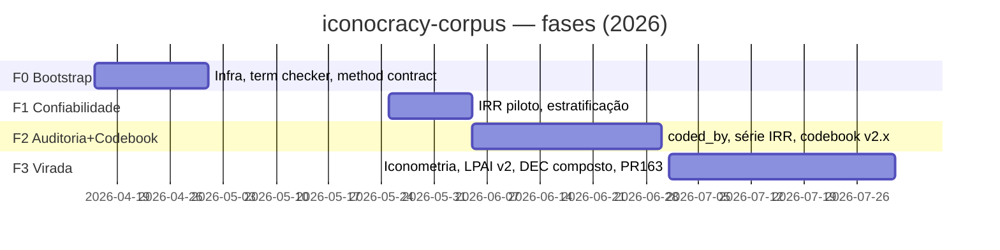

# Deep Research — `anavvanzin/iconocracy-corpus`

**Data:** 2026-07-31 · **Confiança geral:** Alta (fontes primárias: git local, API GitHub, docs do repositório) · **Objeto:** evolução do monorepo da tese ICONOCRACIA (abr–jul/2026)
**Uso previsto:** insumo para a narrativa de reflexividade do Cap. 2 ("a pesquisa sobre a pesquisa") — a linha do tempo do repositório É o rastro documental da virada metodológica.

## Sumário executivo

Monorepo de tese de doutorado (PPGD/UFSC, defesa ~nov/2027) que integra corpus iconográfico (328 registros, 279 codificados), automação de aquisição/codificação por instrumentos LLM, vault Obsidian e manuscrito. **259 commits** no branch de trabalho (250 em `main`) entre 2026-04-16 e 2026-07-31, com aceleração exponencial: abr 25 → mai 2 → jun 88 → jul 144. Autoria de facto **unipessoal** (Ana Vanzin sob **6 identidades git distintas** = 219 commits; +33 Claude; +3 dependabot). A cultura documental é o traço distintivo: **25+ decision docs datados** registram cada virada metodológica — mas **zero tags e zero releases** contradizem a política de release declarada, e 10 issues de health-check semanais permanecem abertas.

## Linha do tempo (fases)

**F0 — Bootstrap (abr/2026, 25 commits).** Primeiro commit 2026-04-16 (dependabot). 2026-04-23: `METHOD_CONTRACT`. 2026-04-24: `check_thesis_terms` + remediação terminológica. 2026-04-25: snapshot congelado N=165 (`Other/`, base do Cap. 3 da época).

**F1 — Confiabilidade (mai/2026, 2 commits no branch; atividade concentrada em decisões).** 2026-05-30: `IRR-PILOTO` (o piloto que descobriu **79/206 arquivos do store que não eram imagens**) + `ESTRATIFICACAO` + `STATUS`. *Caveat:* a contagem mensal usa a ancestralidade do branch atual; maio pode estar subcontado em `main`.

**F2 — Auditoria e Codebook (jun/2026, 88 commits).** 2026-06-09/10: redesenho e execução do IRR inter-instrumento + auditoria `coded_by`. 2026-06-19: reliability-audit design + **dialética Generatividade×Fechamento** (síntese Tier 1/Tier 2). 2026-06-22: fim do gate de país como critério de inclusão; pareamentos IRR opus×gemini e opus×fable; lotes E1. 2026-06-23–25: codebook v2.0→v2.3 (revisão Elicit, conselho de modelos). 2026-06-26: integração de contra-alegorias; verificação Iconclass (48C51 é rótulo interno, não oficial).

**F3 — A virada POSSIBILIDADE (jul/2026, 144 commits — pico).** 2026-07-11: transição **Iconometria** (framework guarda-chuva ⊇ endurecimento). 2026-07-13: auditoria de sincronização (328/328 válidos). #157: codificador-proxy LPAI v2 (Kimi K3) + codebook v2.2.1. #159/#160: camada de captação de imagens e medição do Estrato I; regressão do exportador detectada e corrigida (`e31bda0` → fix). **2026-07-28: DEC aposenta o índice composto** (`endurecimento_score` → `legacy_frozen`). 2026-07-31: plano de consolidação F0–F6, deep research metodológico, dialética rodadas 1–2 (PR #163, aberto).

## Métricas

| Métrica | Valor | Fonte |
|---|---|---|
| Commits (branch de trabalho / main) | 259 / 250 | git local |
| Ritmo mensal | 25 → 2 → 88 → 144 | git local |
| Autoria humana | 1 pessoa, **6 identidades git** (219 commits) | `git shortlog -sne` |
| Corpus (ledger) | 328 registros; 279 codificados (85%) | `records.jsonl`, CLAUDE.md |
| Trajetória do N | ~165 (abr) → 265–278 (jun) → 328 (jul) — aberto por decisão | snapshots/decisões |
| `coded_by` | 11 rótulos; 15 `ana` (4,6%); 48,5% rotinas de ingestão | dialética R1 (verificado 2×) |
| Decision docs datados | 25+ em `docs/decisions/` | ls |
| Tags / Releases | **0 / 0** | git, API |
| Branches remotos | 19 | `git ls-remote` |
| Issues abertas | 15 (10 = health-check semanal não fechado; #56 = regressão do exportador, `ready-for-agent`) | API |
| CI | validação de schema + consistência export + bloqueio de binários (ADR-001) | `.github/workflows/validate.yml` |

## Análise

**1. O repositório é o aparato reflexivo da tese.** A densidade de decision docs datados (IRR-*, ELICIT-*, DEC-*, dialéticas com trace completo) não tem paralelo em repositórios de tese típicos: cada mudança de método tem um artefato citável com data. Isso materializa a alegação do plano ("poucos corpus de tese têm a própria crítica metodológica inscrita no ledger") — a linha do tempo acima é diretamente narrável no Cap. 2.

**2. A contradição release-gate × zero releases.** `docs/OPERATING_MODEL.md` e o release gate definem pipeline de publicação (HF release etc.), e a dialética de 2026-06-19 sintetizou "releases congelados DE um corpus vivo" (tag `corpus-v1.0` + DOI) — **nunca executado**: zero tags, zero releases. O corpus vivo venceu na prática; a promessa de citabilidade congelada segue promessa. É o análogo operacional do achado da rodada 2 em curso (a tensão fixar × manter vivo *performada pelo próprio repositório*).

**3. Fragmentação de identidade autoral.** 6 identidades git para a mesma autora (2 e-mails UFSC, msn, noreply, variações de nome) — irônico num projeto cuja dialética atual gira em torno de **proveniência**: o `git blame` da tese sofre do mesmo mal que o `coded_by` do corpus (48,5% rotinas). Correção barata: um `.mailmap` na raiz.

**4. Higiene de issues.** Os 10 health-checks semanais abertos são ruído que enterra as 5 issues reais; #56 (regressão do exportador) duplica o risco R1 do plano e deveria ser fechada quando F1 executar (ou vinculada ao PR #163).

**5. Aceleração e barramento humano.** 144 commits/mês com autoria unipessoal indica orquestração intensiva de agentes (33 commits Claude assinados; muitos dos 219 são sessões assistidas). O gargalo do projeto não é produção — é **adjudicação** (os pontos ⚖ acumulados nas dialéticas), o que confirma o desenho do plano (portões de aceitação por fase).

## Forças e fraquezas

**Forças:** cultura documental excepcional (decision docs + dialéticas + ADRs); CI de validação com guarda de contrato; hierarquia canônica de dados declarada; reprodutibilidade das análises versionada (notebooks 01–08 + snapshots históricos rotulados); traçabilidade tripla por item.
**Fraquezas:** nenhum release/tag apesar da política declarada (citabilidade pendente); identidades git fragmentadas; issues de bot sem auto-fechamento; dependência de uma única adjudicadora (fator-ônibus = 1, mitigado apenas pela documentação); 18 alertas Dependabot no default branch (6 high) sem triagem visível.

## Recomendações (não executadas — sugestões)

1. Criar `.mailmap` consolidando as 6 identidades (1 commit, resolve o blame histórico).
2. Executar a tag `corpus-v1.0` já sintetizada em 2026-06-19 quando F1 do plano fechar — a primeira materialização da política de release.
3. Auto-fechar health-checks (o próprio workflow que abre pode fechar o anterior) e triar #56 contra o F1.4 do plano.
4. Triar os alertas Dependabot (6 high) — ou documentar por que não se aplicam (superfícies retiradas).

## Fontes

**Primárias (alta confiança):** clone local (`git log/shortlog/ls-remote`, 2026-07-31); API GitHub via MCP (issues, releases); `docs/decisions/*` (25+ docs datados); `CLAUDE.md`; `docs/PLANO-VIRADA-POSSIBILIDADE.md`; dossiê `dialectic-metodologia-2026-07-31/` (números de ledger verificados duas vezes por agentes independentes).
**Não consultadas:** fontes web externas — o objeto é um monorepo de pesquisa pessoal sem cobertura externa; rounds 2–3 do protocolo da skill não se aplicam (registrado como adaptação de método). O script `github_api.py` da skill não existe nesta instalação; substituído por git local + MCP (fonte superior para linha do tempo).

## Avaliação de confiança

| Alegação | Confiança |
|---|---|
| Contagens de commits, datas, autoria, tags, branches | Alta (git local) |
| Contagens de corpus e `coded_by` | Alta (verificadas 2× na dialética R1) |
| Fases e marcos | Alta (decision docs datados) |
| Subcontagem de maio no branch | Média (ancestralidade ≠ main completo) |
| Leitura interpretativa (§§1, 2, 5 da Análise) | Média (inferência sobre dados sólidos) |
