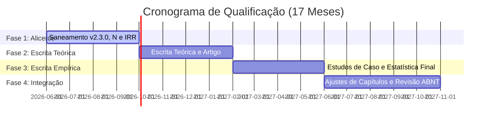

# Roadmap para Qualificação (Novembro 2027) — Trilhas Paralelas & Sprints

Este documento registra o plano de trabalho para a preparação da qualificação da tese de doutorado *ICONOCRACIA*, aprovado via sessão de brainstorming em 25/06/2026.

## 1. Entendimento Geral e Escopo
* **Data da Qualificação**: Novembro de 2027 (~17 meses / 34 sprints quinzenais).
* **Ritmo**: Sem pressa externa; orientação fluida e aprovação contínua por pacotes modulares de entrega.
* **Modelo de Trabalho**: **Abordagem C** (4 Trilhas Paralelas em Sprints de 2 semanas) para acomodar a redação modular e a definição progressiva de capítulos.
* **Entregas Obrigatórias até a Qualificação**:
  1. Resolução do N analítico (165 vs 278).
  2. Finalização do teste de confiabilidade inter-codificadores (IRR / Krippendorff).
  3. Produção e submissão de pelo menos 1 artigo em periódico relevante (Qualis A).

---

## 2. As 4 Trilhas Paralelas de Trabalho

### Trilha 1: Metodologia, Dados & Integridade
Responsável por garantir a solidez empírica do corpus e a validade estatística das análises.

### Trilha 2: Escrita Modular do Manuscrito
Focada em produzir textos teóricos e estudos de caso empíricos de forma independente e incremental.

### Trilha 3: Comunicação & Artigo Científico
Orquestra o planejamento, redação e submissão de artigos baseados no corpus do projeto.

### Trilha 4: Feedback & Orientação (Assíncrona)
Organiza a entrega de pequenos pacotes de leitura modulares ao orientador de forma a manter um fluxo de feedback constante sem sobrecarregá-lo.

---

## 3. Cronograma de Fases e Metas por Sprint

### Fase 1: Consolidação do Alicerce (Meses 1–4) — Sprints 1 a 8
* **Meta Principal**: Saneamento do patch v2.3.0, freeze do dataset, N analítico e IRR.
* **Sprints 1-2**:
  * Trilha 1: Normalização das 8 referências ABNT no [codebook-v2.3.0.md](../../schema/codebook-v2.3.0.md) (remover marcações `[verificar ABNT...]`).
  * Trilha 1: Resolver as 5 `nota_lacuna` nos indicadores de purificação.
  * Trilha 2: Revisar âncoras pendentes na [Introdução](../../tese/manuscrito/Introducao_rev.md) e [Capítulo 1](../../tese/manuscrito/Capitulo1_rev.md).
* **Sprints 3-4**:
  * Trilha 1: Decisão dialética final sobre N analítico (165 vs 278).
  * Trilha 1: Promoção do patch v2.3.0 a master.
  * Trilha 4: Envio do Pacote 1 (Metodologia + IRR + Codebook v2.3.0) ao orientador.
* **Sprints 5-6**:
  * Trilha 1: Execução do teste de confiabilidade inter-codificadores (IRR / Krippendorff) para a v2.3.0.
* **Sprints 7-8**:
  * Trilha 1: Atualização e freeze dos notebooks de análise estatística (`notebooks/01-08`).
  * Trilha 3: Mapeamento de periódicos e escolha do tema do artigo de qualificação.

### Fase 2: Escrita Teórica & Produção do Artigo (Meses 5–8) — Sprints 9 a 16
* **Meta Principal**: Artigo submetido e redação teórica avançada.
* **Sprints 9-12**:
  * Trilha 2: Redação de seções sobre Feminilidade de Estado e Contrato Sexual Visual.
  * Trilha 3: Redação do manuscrito do artigo científico.
  * Trilha 4: Envio do Pacote 2 (Textos Teóricos e Draft do Artigo) ao orientador.
* **Sprints 13-16**:
  * Trilha 2: Redação de seções sobre Visiocracia e Colonialidade do Ver.
  * Trilha 3: Revisão final e submissão do artigo científico.

### Fase 3: Escrita Empírica & Estatística Final (Meses 9–12) — Sprints 17 a 24
* **Meta Principal**: Estudos de caso concluídos.
* **Sprints 17-20**:
  * Trilha 2: Redação dos estudos de caso do Brasil (República e Tribunais/Ceschiatti).
  * Trilha 4: Envio do Pacote 3 (Casos do Brasil + Relatório Estatístico) ao orientador.
* **Sprints 21-24**:
  * Trilha 2: Redação dos estudos de caso comparadores (França-Marianne e Grã-Bretanha-Britannia).

### Fase 4: Integração do Manuscrito & Revisão (Meses 13–17) — Sprints 25 a 34
* **Meta Principal**: Manuscrito da qualificação fechado e revisado.
* **Sprints 25-28**:
  * Trilha 2: Estruturação final dos capítulos da qualificação a partir dos blocos modulares.
  * Trilha 2: Redação de conexões e transições entre os capítulos.
* **Sprints 29-32**:
  * Trilha 2: Revisão bibliográfica fina (ABNT NBR 6023:2025) e checagem de terminologias obrigatórias.
  * Trilha 4: Envio do manuscrito final integrado da qualificação ao orientador (com 2 meses de antecedência).
* **Sprints 33-34**:
  * Trilha 2: Ajustes finos pós-feedback e preparação para a defesa da qualificação em Novembro/2027.

---

## 4. Gerenciamento de Riscos

1. **Risco de Dispersão**:
   * *Mitigação*: Foco estrito em uma entrega bem delimitada por trilha a cada sprint quinzenal. O andamento deve ser registrado no `LOG-SPRINTS.md` (a ser criado).
2. **Refacção Estatística**:
   * *Mitigação*: Bloqueio total de rodadas estatísticas finais nos notebooks antes do freeze metodológico da Fase 1.

---

## 5. Diário de Decisões (Decision Log)
* **2026-06-25 — Escolha de Abordagem**: Definição da Abordagem C (Trilhas Paralelas por Sprints) em oposição à escrita estritamente linear, dada a fluidez da estrutura de capítulos.
* **2026-06-25 — Tema do Artigo**: Mantido aberto até a consolidação do corpus na Fase 1, evitando o foco precoce em "congelamento positivista".
