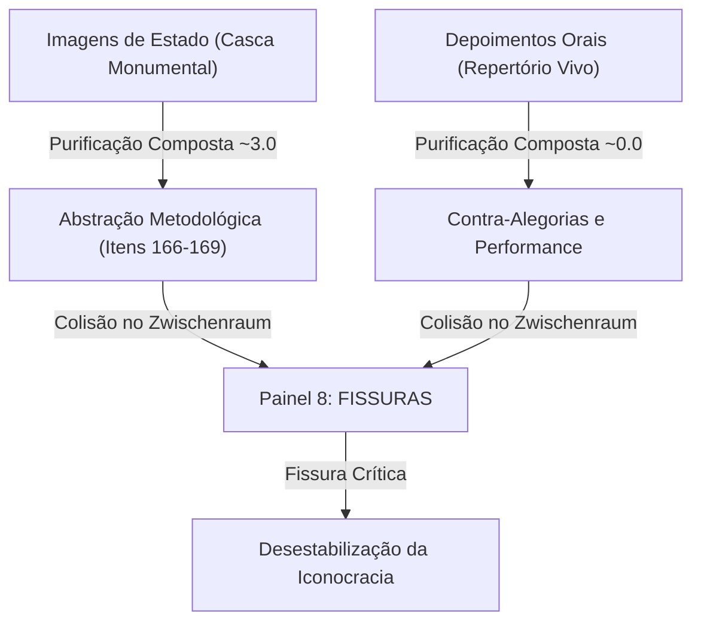

# Comentário do Painel 8: Fissuras — A Carne contra a Casca da Soberania Visual

> [!NOTE]
> **Referência Metodológica (Condição $\zeta$-plus):** 
> Este ensaio realiza a análise integrada do Painel 8 (Fissuras) do Atlas Mnemosyne da Iconocracia, operando a fusão metodológica entre o índice quantitativo de purificação composto ($I_{pc}$) e o repertório qualitativo dos testemunhos orais (itens 170–172), incluindo a auto-codificação reflexiva da própria infraestrutura de pesquisa (itens 166–169).

---

## 1. O *Zwischenraum* do Painel 8: A Colisão Iconográfica

O **Painel 8 (Fissuras)** organiza-se em torno de uma colisão fundamental no *Zwischenraum* (espaço intervalar) entre a rigidez monumental da imagem de Estado e as forças de desmembramento performático que a contestam. Historicamente, a iconocracia jurídica e monetária operou por meio do congelamento do corpo feminino, transformando-o em alegoria vazia e purificada para legitimar a soberania estatal (como visto na *Efígie da República* de 1912, item 145, e nas medalhas comemorativas republicanas). 

No entanto, no espaço de fricção do Painel 8, essas figuras monumentais colidem com as suas próprias fraturas. O painel põe em diálogo direto:
1. **A Casca Monumental (Os Extremos de Purificação):** As representações oficiais do poder soberano, cujas métricas de purificação ($I_{pc}$) orbitam o valor máximo de $3.0$ (desincorporação total, rigidez postural absoluta, dessexualização sistemática e enquadramento arquitetônico rígido).
2. **A Carne e a Voz (Os Extremos de Resistência):** O repertório de contra-alegorias e performances corporais onde o corpo se recusa a ser moldura ou suporte passivo da inscrição estatal, caindo para score $0.0$ de purificação (incorporação plena, fluidez, vocalidade e historicidade racializada/generificada).

---

## 2. A Tensão Métrico-Narrativa: Quantitativo vs. Qualitativo

A análise estatística multidimensional do corpus revela que os regimes **normativo** e **militar** impõem uma disciplina severa à visualidade dos corpos. A purificação composto ($I_{pc}$) não é apenas um score de desenho; ela mede a violência hermenêutica com que o Estado extrai a carne do corpo para substituí-la por mármore ou metal. 

Quando introduzimos a reflexividade metodológica da própria tese no corpus:
* **Item 166 (Diagrama do Pipeline Metodológico):** $I_{pc} = 2.9$. O fluxo científico é ele mesmo um monumento geométrico que esconde a subjetividade da interpretação sob a aparente neutralidade de caixas e setas.
* **Item 167 (Repositório de Código Git):** $I_{pc} = 2.9$. A estrutura de pastas e o histórico de commits disciplinam a memória do trabalho de pesquisa sob a lógica do arquivo burocrático digital.
* **Item 168 (Dataset CSV):** $I_{pc} = 2.8$. A redução de complexidades históricas a scores ordinais ($0$ a $3$) representa o congelamento máximo da imagem, operando uma purificação metodológica.
* **Item 169 (Google Doc Colaborativo):** $I_{pc} = 2.1$. O espaço de rascunho síncrono é uma franja de negociação onde a escrita formalizada ainda carrega a pulsação do debate informal.

Em oposição a esse endurecimento epistêmico e visual, erguem-se os registros de leitura performática e testemunho (itens 170–172), cujos scores de purificação composto são intencionalmente nulos ($0.0$). A inclusão destes itens fecha o circuito metodológico, demonstrando que a tese não reivindica uma soberania visual isolada; em vez disso, ela se submete à mesma grade de análise crítica que aplica ao seu objeto.

---

## 3. A Intervenção Crítica das Testemunhas: O Retorno do Repertório

Os testemunhos orais registrados no Anexo M.4 atuam como cunhas críticas introduzidas nas rachaduras do monumento estatal. Eles revelam que o receptor da imagem não é um sujeito passivo do enquadramento, mas um enunciador situado que lê o monumento a partir do seu próprio corpo.

### A Testemunha 1 e a Recusa da Petrificação Cívica

> [!IMPORTANT]
> **Voz da Testemunha 1 (Liderança Comunitária Feminina):**
> *"Esta estátua fria na praça, sem olhos de verdade, não representa as mulheres que sustentam esta comunidade. É uma casca de pedra feita para justificar a força do Estado, não a vida."*

Ao analisar o monumento público sob a ótica da vida cotidiana, a Testemunha 1 desconstrói a soberania estética da alegoria republicana. A "casca de pedra" é desnudada como um instrumento de coerção cívica. O silêncio do mármore é confrontado com o barulho e a vitalidade das mulheres que sustentam a base da comunidade. Há aqui uma denúncia direta da **desincorporação** e da **rigidez postural** como tecnologias de alienação política.

### A Testemunha 2 e a Fissura do Contrato Racial-Visual

> [!WARNING]
> **Voz da Testemunha 2 (Estudante/Ativista Negra):**
> *"Uma alegoria da República branca e impecável construída sobre o silenciamento das mulheres negras e indígenas. O contrato social que ela celebra é, na verdade, um contrato de submissão e invisibilidade que se veste de direito."*

A Testemunha 2 insere o marcador pós-colonial e decolonial diretamente no centro da discussão hermenêutica. A pureza cívica da alegoria soberana (sempre branca, neoclássica e dessexualizada) é revelada como o disfarce estético de um **contrato racial** excludente. A rigidez da República não é apenas postural; é a rigidez de uma hierarquia colonial petrificada que se apresenta como universal. O "direito" inscrito na imagem é lido como a codificação da invisibilidade dos corpos subalternizados.

### A Testemunha 3 e a Profanação Performática

> [!CAUTION]
> **Voz da Testemunha 3 (Artista Visual / Performer):**
> *"Ao desmembrar e expor as tripas e a carne da soberania estatal, a contra-alegoria performática destrói o mito da pureza cívica e revela a violência fundadora da iconocracia jurídica."*

A Testemunha 3 aponta para o potencial revolucionário da **contra-alegoria**. Se a iconocracia purifica os corpos para apagar a violência do Estado, a performance grotesca reverte esse fluxo: ela expõe a carnalidade, a visceralidade e o sangue sob a armadura de metal. O desmembramento artístico da alegoria destrói a solenidade do direito, transformando o monumento em ruína e abrindo espaço para novas formas de visualidade livre e incorporada.

---

## 4. Conclusão: O Atlas como Dispositivo Dialético

O Painel 8 demonstra que a iconocracia não é invulnerável; suas fissuras são abertas no momento em que o arquivo é confrontado com o repertório. Ao mapear e tabular essas tensões, este Atlas não se limita a constatar a petrificação do visual pelo direito. Ao incluir a si mesma no corpus (itens 166–169) e ao dar centralidade à voz das testemunhas (itens 170–172), a tese renuncia à pretensão de soberania visual isolada e constrói uma metodologia honesta, dialética e radicalmente situada. As fissuras da imagem são, em última análise, as janelas pelas quais o corpo vivo retorna para assombrar a ordem jurídica.
