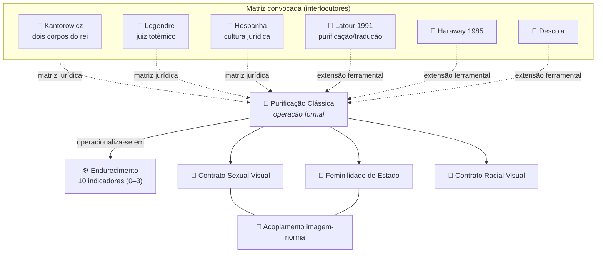

# Glossário

> [!info] Como ler este glossário
> Verbete = **termo** · **categoria** (selo colorido) · **definição** · **proveniência/autoria** · **uso na tese**.
> A categoria de cada termo indica seu *estatuto epistêmico* dentro da pesquisa — distinção decisiva para preservar a **autoria** dos conceitos originais e situar com honestidade os operadores tomados de empréstimo.

## Legenda das categorias

| Selo | Categoria | O que significa |
|:---:|---|---|
| 🔹 | **Autoral** | Conceito **original da tese**. Não deve ser atribuído a terceiros, ainda que dialogue com eles. |
| 🔸 | **Mobilizado** | Termo de outro autor, **deslocado** para o recorte jurídico-iconográfico da tese. |
| ⚙️ | **Operacional** | Instrumento metodológico de codificação/análise do corpus. |
| 🏛️ | **Alegoria** | Figura alegórica feminina nacional (objeto empírico do corpus). |
| 👤 | **Interlocutor** | Autor(a) e obra de referência cuja matriz teórica é convocada. |

> [!warning] Regra de autoria (não-negociável)
> Os **quatro conceitos autorais** — Contrato Sexual Visual, Feminilidade de Estado, Contrato Racial Visual e Purificação Clássica — **não** são derivações cedidas a Pateman, Mondzain, Legendre, Latour ou Haraway. Esses autores entram como **raízes genealógicas** ou **matriz ferramental**; a *extensão visual/jurídica* é autoral.

---

## Mapa conceitual

### Progressão dos regimes iconocráticos

---

## 1 · Conceitos autorais 🔹

### Contrato Sexual Visual
🔹 **Autoral — Conceito #1** · *Cap. 1*

Extensão **visual** da tese de Carole Pateman: se o contrato social clássico oculta um *contrato sexual* que institui o direito político masculino sobre o corpo feminino, a alegoria feminina do Estado é o **regime de imagem** em que esse pacto se torna visível e se naturaliza. A mulher é representada para **figurar a lei** justamente quando dela é excluída como sujeito.

> [!note] Proveniência
> Pateman (1988) é a **fonte do contrato não-visual**. A passagem ao registro icônico-jurídico é autoral — *não* atribuir o "Contrato Sexual Visual" a Pateman.

### Feminilidade de Estado
🔹 **Autoral — Conceito #2** · *Cap. 2*

Dispositivo pelo qual o Estado se faz representar por um **corpo feminino idealizado** (República, Justiça, Liberdade) — corpo investido de função totêmica e normativa, esvaziado de mulher histórica concreta. Articula a gestão jurídica da imagem (Legendre) com a economia do feminino como *pólo de pureza/poluição* (Carson, *hystéra*).

> [!note] Raízes genealógicas
> Legendre (**juiz totêmico**, gestão das imagens) + Carson (**hystéra**). *Não* atribuir a Mondzain.

### Contrato Racial Visual
🔹 **Autoral — Conceito #3** · *Cap. 3*

A **branquitude constitutiva** da alegoria dita "universal": a figura feminina neoclássica que personifica o Estado pressupõe e produz um corpo branco como norma do humano-jurídico. Inclui a **transferência transatlântica** de modelos neoclássicos (Europa → Américas) e fundamenta a leitura da *colonialidade do ver*.

### Purificação Clássica
🔹 **Autoral — Conceito #4** · *Cap. 5.2*

Operação formal de **extração do feminino histórico** para fixá-lo no **eterno alegórico**: a mulher concreta é depurada de tempo, desejo e narrativa até virar emblema imóvel do Estado. É a operação que o **endurecimento** mede empiricamente.

> [!note] Dupla matriz
> **Matriz primária (jurídica):** Kantorowicz · Legendre · Hespanha.
> **Extensão ferramental:** Latour (1991) · Haraway (1985) · Descola.
> No manuscrito final, usar sempre **"Purificação Clássica"** (não "purificação iconocrática"). Os operadores Haraway/Latour/Descola entram como **matriz ferramental**, *não* como filiação a uma tradição — termo **"ciberfeminismo" proibido** no texto da tese (reservado a paper derivado pós-defesa).

### Endurecimento
🔹 **Autoral / ⚙️ Operacional** · *Cap. 6–7*

**Operacionalização empírica** da Purificação Clássica em **10 indicadores ordinais (0–3)**. Sempre em português — **nunca** "hardening" nem "embrutecimento". Mede o grau em que uma alegoria foi depurada do feminino vivo e fixada como emblema estatal. → ver §2.

### Regime Iconocrático
🔹 **Autoral** · *Cap. 2*

Configuração histórica do acoplamento entre imagem alegórica e norma estatal. A tese identifica três regimes em progressão — **FUNDACIONAL → NORMATIVO → MILITAR** — e um momento de ruptura, a **CONTRA-ALEGORIA**. → ver §2.

### Acoplamento imagem-norma
🔹 **Autoral** · *Cap. 5*

Mecanismo pelo qual uma **imagem** (alegoria) e uma **norma** (jurídico-política) se prendem uma à outra, de modo que ver a figura é reconhecer a lei. Tag de vault: `#acoplamento-imagem-norma`.

### Pintura de alma
🔹 **Autoral** (síntese Legendre + Goodrich + Mondzain) · *Cap. 1*

A imagem que não apenas representa mas **institui** o sujeito jurídico — a face do poder que "pinta" interiormente o governado, fabricando obediência pela via estética.

### Iconocracia
🔸 **Mobilizado** (Mondzain 2002 + tese) · *Cap. 2*

Governo **pela imagem**: regime de poder em que a autoridade se exerce pela produção e gestão de ícones. A tese desloca o termo de Mondzain para o campo **jurídico-penal**.

### Visiocracia
🔸 **Mobilizado** (Goodrich, 2014) · *Cap. 1*

Poder exercido pelo **visual** na cultura jurídica; a dimensão estética do direito. Interlocução com a estética jurídica de Peter Goodrich.

---

## 2 · Aparato operacional ⚙️

### Os três regimes iconocráticos (+ contra-alegoria)

| Regime | Corpo | Lógica | Marca visual dominante |
|---|---|---|---|
| **FUNDACIONAL** | corpo vivo, sacrificial | instauração revolucionária | gesto, movimento, *pathos* |
| **NORMATIVO** | corpo domesticado | rotina burocrática do Estado | serenidade, atributos heráldicos |
| **MILITAR** | corpo endurecido | imperial, bélico | rigidez, armadura, monumentalidade |
| **CONTRA-ALEGORIA** | corpo contestado | subversão/reapropriação | paródia, ruptura, denúncia (`#contra-alegoria`) |

### Os 10 indicadores de endurecimento (escala ordinal 0–3)

| # | Indicador | Mede |
|:--:|---|---|
| 1 | **desincorporação** | perda de corpo/carne vivos em favor do emblema |
| 2 | **rigidez_postural** | imobilização da pose; ausência de gesto |
| 3 | **dessexualização** | apagamento de marcas de desejo/sexualidade |
| 4 | **uniformização_facial** | rosto-tipo, intercambiável, sem individuação |
| 5 | **heraldicização** | conversão em brasão/atributo de Estado |
| 6 | **enquadramento_arquitetônico** | submissão da figura à moldura monumental/forense |
| 7 | **apagamento_narrativo** | supressão de história/cena em favor do ícone fixo |
| 8 | **monocromatização** | redução cromática; tom de pedra/metal |
| 9 | **serialidade** | repetição padronizada (moeda, selo) |
| 10 | **inscrição_estatal** | legenda/insígnia que ancora a figura ao Estado |

> [!tip] Leitura da escala
> `0` = ausente · `1` = incipiente · `2` = marcado · `3` = pleno. **`endurecimento_score = 0` é um escore válido** (baixa purificação), *não* "não-codificado".

### Critérios de inclusão no corpus (todos obrigatórios)

1. Figura **alegórica feminina**;
2. **Função jurídico-política** explícita;
3. Datável em **1800–2000** (prioridade 1880–1920);
4. **Suporte aceito** (moeda · selo · monumento/escultura · arquitetura forense · estampa/gravura · frontispício · papel-moeda · cartaz).

> [!note] País deixou de ser critério (2026-06-22)
> O **país** é hoje *variável analítica*, **não** gate de inclusão — a alegoria "universal" é transnacional (base do Contrato Racial Visual).

### Níveis de análise (método de Panofsky)
⚙️ / 👤 *Erwin Panofsky, Studies in Iconology (1939)*

| Nível | Camada | O que se descreve |
|---|---|---|
| **I — Pré-iconográfico** | assunto primário/natural | formas puras, percepção (experiência prática) |
| **II — Iconográfico** | assunto secundário/convencional | identificação de temas, motivos, atributos |
| **III — Iconológico** | significado intrínseco | sentido cultural/ideológico profundo |

> A **iconologia** é o método interpretativo abrangente (nível III), forjado por Aby Warburg e seu círculo, do qual Panofsky é o representante mais eminente.

### Iconclass
⚙️ / 👤 *Henri van de Waal (concebido nos anos 1970); sistema de classificação iconográfica*

Sistema decimal de classificação do **conteúdo temático** de imagens (10 divisões 0–9, à maneira da CDD; divisão **4** = *Society, Civilization, Culture*). Códigos pertinentes ao recorte da tese (rótulos verificados na API oficial iconclass.org, 2026-06-26):

| Código | Rótulo oficial (EN) | Relevância |
|---|---|---|
| **44** | *state; law; political life* | ramo **jurídico-político central** do corpus |
| **11M44** | *Justice, 'Justitia'; 'Giustitia divina' (Ripa) ~ one of the Four Cardinal Virtues* | personificação da Justiça (virtude cardeal) |
| **48C51** | *painting (including book-illumination, miniature-painting)* | forma de arte (ver aviso) |

> [!warning] Corrigir a referência ao código 48C51
> O `CLAUDE.md` registra **"Iconclass 48C51 = código-chave para iconografia feminista"**, mas o **iconclass.org oficial** (verificado 3-0 no *deep-research* + confirmado na API JSON, 2026-06-26) rotula `48C51` como **"painting (including book-illumination, miniature-painting)"** — é a *forma de arte pintura*, não um tema feminista/jurídico. Os códigos efetivamente pertinentes ao recorte são **44** (*state; law; political life*) e **11M44** (*Justitia*). **Recomendação:** corrigir a anotação no `CLAUDE.md`. *(Não alterei o `CLAUDE.md` — decisão da autora.)*

---

## 3 · Léxico warburguiano 🔸

> [!info] Convenção
> Termos de Aby Warburg permanecem **em alemão** no manuscrito.

| Termo | Significado | Uso na tese |
|---|---|---|
| **Pathosformel** | "fórmula de pathos": entrelaçamento indissociável de carga emocional e fórmula iconográfica, transmitido através de épocas e culturas | identifica o gesto-matriz do corpo alegórico vivo (regime FUNDACIONAL) |
| **Nachleben** (*der Antike*) | "sobrevivência/pós-vida da Antiguidade": persistência e retorno de formas antigas | fundamenta a leitura genealógica da alegoria neoclássica |
| **Zwischenraum** | "espaço-entre": intervalo onde o sentido se produz, entre imagens | base dos **painéis comparativos** (`zwischenraum_panels`) · *Cap. 8* |
| **Denkraum** | "espaço de pensamento/contemplação": distância reflexiva ante a imagem | distância crítica perdida no endurecimento |
| **Mnemosyne / Bilderatlas** | Atlas de imagens inacabado (1924–1929; 63 pranchas de reproduções pregadas em painéis negros), montagem de constelações visuais trans-históricas | modelo formal do método comparativo da tese |

---

## 4 · Interlocutores teóricos 👤

| Autor(a) | Obra de referência | Conceito convocado | Papel na tese |
|---|---|---|---|
| **Ernst Kantorowicz** | *The King's Two Bodies* (Princeton UP, 1957) | **dois corpos do rei** (*body natural* mortal × *body politic* perpétuo) | matriz jurídica da Purificação Clássica; o corpo alegórico como "corpo político" feminino |
| **Pierre Legendre** | *Dieu au miroir: étude sur l'institution des images* (Fayard, 1994); *L'Amour du censeur* (Seuil, 1974) | **institution des images**; juiz totêmico; gestão das imagens | raiz da Feminilidade de Estado |
| **António M. Hespanha** | *Cultura Jurídica Europeia: síntese de um milénio* (Almedina, **2005**) | **cultura jurídica** (ampliar as fontes para além da legislação) | enquadramento histórico-jurídico do corpus |
| **Carole Pateman** | *The Sexual Contract* (**Stanford UP**, 1988) | **contrato sexual** (não-visual) | fonte do Contrato Sexual Visual |
| **Marie-José Mondzain** | *Image, icône, économie* (**Seuil, 2002**) | **economia icônica** (raiz bizantina do imaginário) | fonte de "iconocracia"; *não* de Feminilidade de Estado |
| **Anne Carson** | *Dirt and Desire* (in *Men in the Off Hours*, 2000) | **hystéra**; poluição/pureza do feminino na Antiguidade | raiz da Feminilidade de Estado |
| **Bruno Latour** | *Nous n'avons jamais été modernes* (La Découverte, 1991) | **purificação / tradução** (zonas ontológicas distintas) | extensão ferramental da Purificação Clássica |
| **Donna Haraway** | *A Manifesto for Cyborgs* (*Socialist Review*, 1985) | crítica das fronteiras natureza/cultura | extensão ferramental (não como "ciberfeminismo") |
| **Philippe Descola** | *Les Formes du visible* (Seuil, 2021) | figuração; superação do dualismo natureza/cultura | extensão ferramental |
| **Peter Goodrich** | *Visiocracy* (*Critical Inquiry*, **2013**) | **visiocracia** | poder do visual no direito |
| **Maurice Agulhon** | *Marianne au combat* (1979) · *Marianne au pouvoir* (1989) | iconografia republicana francesa | obra canônica sobre Marianne/La République |
| **Judith Resnik & Dennis Curtis** | *Representing Justice* (Yale UP, 2011) | iconografia da Justiça nos tribunais | referência central do recorte jurídico-iconográfico |

---

## 5 · Alegorias femininas nacionais 🏛️

| País | Figuras | Origem / função jurídico-política |
|:--:|---|---|
| 🇫🇷 **FR** | **Marianne / La République**, **La Liberté**, **La Justice** | a escolha de figura feminina para personificar a República é central à imagética republicana (Agulhon); auge no "longo século XIX" |
| 🇬🇧 **UK** | **Britannia**, **Justice**, **Hibernia**, **Scotia** | personificação imperial e das nações constituintes |
| 🇩🇪 **DE** | **Germania**, **Justitia**, **Minerva** | alegoria totêmica da consciência nacional alemã, emergente no fim do séc. XVIII |
| 🇺🇸 **US** | **Columbia**, **Lady Liberty**, **Lady Justice**, **America** | personificação cívica da república/Estado |
| 🇧🇪 **BE** | **La Belgique** | alegoria nacional belga |
| 🇧🇷 **BR** | **A República**, **A Justiça** | recepção transatlântica do modelo neoclássico (Contrato Racial Visual) |
| — | **Justitia / Lady Justice** | de *Iustitia* romana (introduzida sob Augusto); balança + espada (+ venda); persistência notável da Antiguidade aos tribunais modernos (Resnik & Curtis, 2011) |

> [!note] Países fora da lista-núcleo
> AT, NL, DK, ES já integram o corpus — a lista é **não-exaustiva** (qualquer país que satisfaça os 4 critérios é elegível).

---

## 6 · Termos transversais e marcadores

| Termo / flag | Significado |
|---|---|
| **Colonialidade do ver** | regime visual que naturaliza a branquitude da alegoria "universal" (`#colonialidade-do-ver`) |
| **Contra-alegoria** | imagem que subverte/contesta a alegoria estatal (`#contra-alegoria`) |
| **Ausência alegórica** | controle negativo: contextos sem alegoria feminina esperada (`#ausencia-alegorica`) |
| **Zwischenraum panel** | painel comparativo warburguiano de imagens do corpus |
| **Suporte** | meio material da imagem (moeda, selo, monumento, estampa, frontispício, papel-moeda, cartaz) |
| `#verificar` | marcador de dado a confirmar antes da defesa |

---

## Referências (ABNT NBR 6023:2025)

> [!note] Cotejado com `vault/tese/references.bib`
> Entradas alinhadas às chaves BibTeX da tese (`@chave` ao final). Onde a tese mantém edição original **e** tradução PT, ambas constam.

AGULHON, Maurice. **Marianne au combat**: l'imagerie et la symbolique républicaines de 1789 à 1880. Paris: Flammarion, 1979. `@agulhon1979`

AGULHON, Maurice. **Marianne au pouvoir**: l'imagerie et la symbolique républicaines de 1880 à 1914. Paris: Flammarion, 1989. `@agulhon1989`

CARSON, Anne. Dirt and Desire: the phenomenology of female pollution in antiquity. In: CARSON, Anne. **Men in the Off Hours**. New York: Alfred A. Knopf, 2000. `@carson2000`

DESCOLA, Philippe. **Les Formes du visible**: une anthropologie de la figuration. Paris: Seuil, 2021. `@descola2021` [trad. PT: **As Formas do Visível**. São Paulo: Ubu, 2023. `@descola2023`]

GOODRICH, Peter. Visiocracy: on the futures of the fingerpost. **Critical Inquiry**, v. 39, 2013. `@goodrich2013a`

HARAWAY, Donna. A manifesto for cyborgs: science, technology, and socialist feminism in the 1980s. **Socialist Review**, n. 80, 1985. `@haraway1985` [trad. PT: Manifesto ciborgue. In: SILVA, T. T. (org.). **Antropologia do Ciborgue**. Belo Horizonte: Autêntica, 2009. `@haraway2009`]

HESPANHA, António Manuel. **Cultura Jurídica Europeia**: síntese de um milénio. Coimbra: Almedina, 2005. `@hespanha2005`

KANTOROWICZ, Ernst H. **The King's Two Bodies**: a study in mediaeval political theology. Princeton: Princeton University Press, 1957. `@kantorowicz1957` [trad. PT: **Os Dois Corpos do Rei**. São Paulo: Companhia das Letras, 1998. `@kantorowicz1998`]

LATOUR, Bruno. **Nous n'avons jamais été modernes**: essai d'anthropologie symétrique. Paris: La Découverte, 1991. `@latour1991` [trad. PT: **Jamais Fomos Modernos**. Rio de Janeiro: Editora 34, 1994. `@latour1994`]

LEGENDRE, Pierre. **Dieu au miroir**: étude sur l'institution des images. Paris: Fayard, 1994. `@legendre1994` [ver tb. **L'Amour du censeur**: essai sur l'ordre dogmatique. Paris: Seuil, 1974. `@legendre1974`]

MONDZAIN, Marie-José. **Image, icône, économie**: les sources byzantines de l'imaginaire contemporain. Paris: Seuil, 2002. `@mondzain2002`

PANOFSKY, Erwin. **Studies in Iconology**: humanistic themes in the art of the Renaissance. New York: Oxford University Press, 1939. `@panofsky1939`

PATEMAN, Carole. **The Sexual Contract**. Stanford: Stanford University Press, 1988. `@pateman1988` [trad. PT: **O contrato sexual**. Rio de Janeiro: Paz e Terra, 1993. `@pateman1993`]

RESNIK, Judith; CURTIS, Dennis. **Representing Justice**: invention, controversy, and rights in city-states and democratic courtrooms. New Haven: Yale University Press, 2011. `@resnikcurtis2011`

VAN DE WAAL, Henri. **Iconclass**: an iconographic classification system. Amsterdam: North-Holland, 1973 [17 v., 1973–1985]. `@vandewaal1973`

WARBURG, Aby. **Der Bilderatlas Mnemosyne**. Ed. Martin Warnke. Berlin: Akademie Verlag, 2000 [orig. 1924–1929]. `@warburg2000`

> [!note] Pendências bibliográficas — atualizado 2026-06-26
> ✅ **Resolvidas** (chaves criadas no `references.bib` via piloto Elicit): Carson `@carson2000` (*Dirt and Desire* / *Men in the Off Hours*, com apoios Viveiros de Castro 2025 e Hanson 1975); Resnik & Curtis `@resnikcurtis2011`; Iconclass `@vandewaal1973`.
> ⏳ **Restam** (TODOs já na bib, a cotejar com Zotero): edições de Legendre (`legendre1974`/`legendre1994`); demais TODOs do backlog do `.bib`.

---

> [!note] Proveniência deste glossário
> Verbetes **autorais e operacionais** ancorados em `CLAUDE.md` + `concepts/glossario.md` (glossário canônico de conceitos operativos). Verbetes **teóricos e de alegorias** fundamentados em pesquisa multi-fonte com verificação adversarial (*deep-research*, 2026-06-26; 23 fontes, fontes primárias iconclass.org, Princeton UP, Yale UP, Stanford UP, monoskop/Latour, ehne.fr).
> A síntese final do *deep-research* foi interrompida por limite de sessão; em seguida fez-se **verificação cirúrgica** dos pontos pendentes direto nas fontes (WebFetch). **Confirmados:** rótulos Iconclass `48C51`/`44`/`11M44` (API JSON oficial). **Permanecem `#verificar`** (a cotejar com Zotero/`references.bib`): edição/ano de Hespanha; volume da *Ars Dogmatica* de Legendre; editora/edição PT de Mondzain (2002); edição PT de Descola; edição crítica do Atlas de Warburg.
