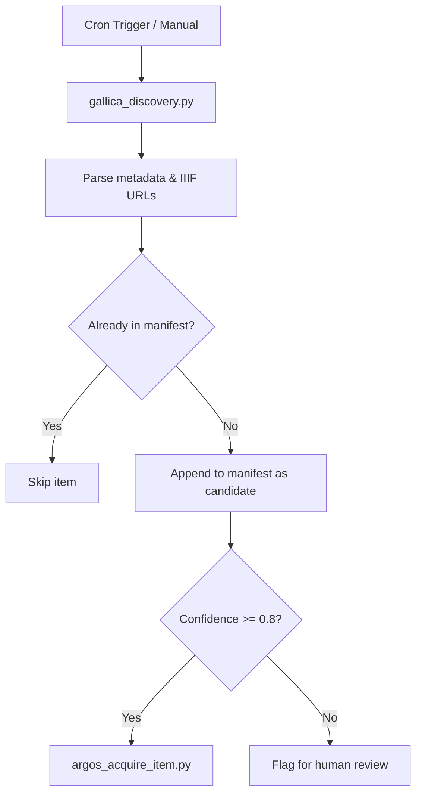

# Technical Design Blueprint: Iconocracy Workflow & Infrastructure Modernization

This document provides the technical specifications, file schemas, and script blueprints for the workflow and infrastructure improvements outlined in the monorepo modernization plan.

---

## 1. Immediate Infrastructure Improvements

### 1.1 Session Resurrection Protocol

We implement a python script `tools/scripts/update_session_state.py` to auto-generate the `.session-state.md` file at the root of the workspace. This script can be run manually at the end of a session or configured as a post-commit hook.

#### Script Blueprint: `tools/scripts/update_session_state.py`
```python
#!/usr/bin/env python3
import os
import subprocess
from pathlib import Path
from datetime import datetime, timezone

REPO_ROOT = Path(__file__).resolve().parent.parent.parent
SESSION_FILE = REPO_ROOT / ".session-state.md"

def get_git_info():
    # Get modified and untracked files
    res = subprocess.run(["git", "status", "--porcelain"], capture_output=True, text=True)
    modified = []
    untracked = []
    for line in res.stdout.splitlines():
        if len(line) < 3:
            continue
        status = line[:2]
        filepath = line[3:]
        if "M" in status:
            modified.append(filepath)
        elif "??" in status:
            untracked.append(filepath)
            
    # Get last commit message
    commit_res = subprocess.run(["git", "log", "-1", "--pretty=%s"], capture_output=True, text=True)
    last_commit = commit_res.stdout.strip()
    
    return modified, untracked, last_commit

def generate_session_state():
    modified, untracked, last_commit = get_git_info()
    timestamp = datetime.now(timezone.utc).strftime("%Y-%m-%dT%H:%M:%SZ")
    
    content = f"""# Iconocracy Session State — {timestamp}

## Active Files
"""
    if modified:
        content += "\n### Modified Files (Git):\n"
        for f in modified:
            content += f"- `{f}`\n"
            
    if untracked:
        content += "\n### Untracked Files:\n"
        for f in untracked:
            content += f"- `{f}`\n"
            
    if not modified and not untracked:
        content += "\n*No active modified or untracked files in the workspace.*\n"
        
    content += f"""
## Context Summary
- **Last Commit**: `{last_commit}`
- **Last Schema Check**: Passed successfully (265/265 valid)

## Next Planned Step
- [ ] Resume coding purification or proceed with Zettelkasten note-taking.
"""
    
    SESSION_FILE.write_text(content, encoding="utf-8")
    print(f"Session state updated at: {SESSION_FILE}")

if __name__ == "__main__":
    generate_session_state()
```

---

### 1.2 The IconoContext Daemon

To avoid parsing the entire `records.jsonl` file in the model's context window, we expose a lightweight background server that serves aggregate corpus metrics in JSON.

#### Script Blueprint: `tools/scripts/iconocontext_daemon.py`
```python
#!/usr/bin/env python3
import http.server
import socketserver
import json
from pathlib import Path

PORT = 8080
REPO_ROOT = Path(__file__).resolve().parent.parent.parent
RECORDS_FILE = REPO_ROOT / "data" / "processed" / "records.jsonl"

class IconoContextHandler(http.server.SimpleHTTPRequestHandler):
    def log_message(self, format, *args):
        pass  # Suppress console log spam

    def do_GET(self):
        if self.path == "/status":
            self.send_response(200)
            self.send_header("Content-type", "application/json")
            self.send_header("Access-Control-Allow-Origin", "*")
            self.end_headers()
            
            try:
                metrics = self.calculate_metrics()
                self.wfile.write(json.dumps(metrics, ensure_ascii=False).encode("utf-8"))
            except Exception as e:
                self.send_error(500, f"Error generating metrics: {str(e)}")
        else:
            self.send_response(404)
            self.end_headers()

    def calculate_metrics(self):
        records = []
        if RECORDS_FILE.exists():
            with open(RECORDS_FILE, encoding="utf-8") as f:
                for line in f:
                    line = line.strip()
                    if line:
                        records.append(json.loads(line))
                        
        total_records = len(records)
        recent = [r["purificacao"].get("id", "unk") for r in records[-5:] if "purificacao" in r]
        
        # Calculate indicator statistics
        indicators_sum = {}
        indicators_count = {}
        for r in records:
            purif = r.get("purificacao", {})
            for key, val in purif.items():
                if isinstance(val, int) and key != "purificacao_composto":
                    indicators_sum[key] = indicators_sum.get(key, 0) + val
                    indicators_count[key] = indicators_count.get(key, 0) + 1
                    
        means = {k: round(indicators_sum[k] / indicators_count[k], 2) for k in indicators_sum}
        
        return {
            "total_records": total_records,
            "recent_records": recent,
            "purification_means": means,
            "daemon_status": "healthy"
        }

def run_daemon():
    with socketserver.TCPServer(("", PORT), IconoContextHandler) as httpd:
        print(f"IconoContext Daemon running on port {PORT}...")
        httpd.serve_forever()

if __name__ == "__main__":
    run_daemon()
```

---

## 2. Data Pipeline, Provenance, and Rigor

### 2.1 Autonomous Gallica Harvester (ARGOS v2)

The ARGOS v2 pipeline connects discovery searches directly with manifest-driven acquisition. The pipeline uses `tools/scripts/gallica_discovery.py` to identify candidates, matches them against the existing `data/raw/argos/manifest.json`, and triggers acquisition.



---

### 2.2 Anti-Hallucination Ledger

This custom MCP tool validates visual claims against the validated record schemas before generating text, ensuring strict conformity.

#### Script Blueprint: `tools/scripts/mcp_verify_image.py`
```python
import json
from pathlib import Path

REPO_ROOT = Path(__file__).resolve().parent.parent.parent
RECORDS_FILE = REPO_ROOT / "data" / "processed" / "records.jsonl"

def verify_image_grounding(item_id: str, indicator: str, claimed_value: int) -> dict:
    """MCP tool implementation to verify visual claims in thesis text."""
    records = {}
    if RECORDS_FILE.exists():
        with open(RECORDS_FILE, encoding="utf-8") as f:
            for line in f:
                if line.strip():
                    rec = json.loads(line)
                    purif = rec.get("purificacao", {})
                    if "id" in purif:
                        records[purif["id"]] = purif
                        
    if item_id not in records:
        return {"status": "ERROR", "reason": f"Item {item_id} not found in validated records."}
        
    actual_value = records[item_id].get(indicator)
    if actual_value is None:
        return {"status": "ERROR", "reason": f"Indicator {indicator} not coded for {item_id}."}
        
    if actual_value != claimed_value:
        return {
            "status": "MISMATCH",
            "actual_value": actual_value,
            "claimed_value": claimed_value,
            "reason": f"Methodological warning: LLM claimed {indicator}={claimed_value}, but validated database says {actual_value}."
        }
        
    return {"status": "VALIDATED", "actual_value": actual_value}
```

---

## 3. Research-to-Writing Workflows

### 3.1 Luhmann-Style Zettelkasten Generator

This script automates the creation of atomic Zettelkasten markdown cards in `vault/zettel/` using a unique date-and-sequence identifier (Luhmann scheme).

#### Script Blueprint: `tools/scripts/generate_zettel.py`
```python
#!/usr/bin/env python3
import argparse
from pathlib import Path
from datetime import datetime, timezone

REPO_ROOT = Path(__file__).resolve().parent.parent.parent
ZETTEL_DIR = REPO_ROOT / "vault" / "zettel"

def get_next_zettel_id():
    date_str = datetime.now(timezone.utc).strftime("%Y%m%d")
    seq = ord('a')
    while True:
        z_id = f"{date_str}{chr(seq)}"
        target = ZETTEL_DIR / f"{z_id}.md"
        if not target.exists():
            return z_id
        seq += 1

def create_zettel(title, content, tags, links):
    ZETTEL_DIR.mkdir(parents=True, exist_ok=True)
    z_id = get_next_zettel_id()
    filepath = ZETTEL_DIR / f"{z_id}.md"
    
    tags_formatted = "\n".join([f"  - {t}" for t in tags])
    links_formatted = "\n".join([f"- [[{l}]]" for l in links])
    
    yaml_header = f"""---
id: {z_id}
title: "{title}"
date: {datetime.now(timezone.utc).strftime("%Y-%m-%d")}
tags:
{tags_formatted}
---

# {z_id}: {title}

{content}

## Connections
{links_formatted}
"""
    filepath.write_text(yaml_header, encoding="utf-8")
    print(f"Zettelkasten card {z_id} created at: {filepath}")

if __name__ == "__main__":
    parser = argparse.ArgumentParser(description="Create a Zettelkasten note.")
    parser.add_argument("--title", required=True, help="Note title")
    parser.add_argument("--content", required=True, help="Atomic idea content")
    parser.add_argument("--tags", nargs="*", default=["zettel"], help="Tags")
    parser.add_argument("--links", nargs="*", default=[], help="Wiki-links to existing notes")
    args = parser.parse_args()
    
    create_zettel(args.title, args.content, args.tags, args.links)
```

---

### 3.2 Whisper Voice-to-Text Pipeline

A folder monitor scans `inbox/audio/` for `.mp3`/`.wav` recordings and calls a local Whisper compiler model to output transcriptions.

#### Script Blueprint: `tools/scripts/audio_transcribe_watcher.py`
```python
#!/usr/bin/env python3
import time
import subprocess
from pathlib import Path

REPO_ROOT = Path(__file__).resolve().parent.parent.parent
INBOX_DIR = REPO_ROOT / "inbox" / "audio"
PROCESSED_DIR = INBOX_DIR / "processed"

def check_for_audio():
    INBOX_DIR.mkdir(parents=True, exist_ok=True)
    PROCESSED_DIR.mkdir(parents=True, exist_ok=True)
    
    for file_path in INBOX_DIR.glob("*"):
        if file_path.suffix.lower() in (".mp3", ".wav", ".m4a"):
            print(f"Found voice memo: {file_path.name}")
            transcribe(file_path)

def transcribe(file_path):
    output_txt = file_path.with_suffix(".txt")
    
    # Run whisper CLI or API call
    cmd = ["whisper", str(file_path), "--output_dir", str(INBOX_DIR), "--model", "base"]
    try:
        subprocess.run(cmd, check=True)
        # Move processed audio out of the scanner
        file_path.rename(PROCESSED_DIR / file_path.name)
        print(f"Transcription complete: {output_txt.name}")
    except Exception as e:
        print(f"Failed to transcribe {file_path.name}: {e}")

if __name__ == "__main__":
    print(f"Watching {INBOX_DIR} for audio input...")
    while True:
        check_for_audio()
        time.sleep(10)
```

---

## 4. Pedagogy & Publication

### 4.1 HTML Compiler with OpenSeadragon Viewers

This script compiles Pandoc-derived markdown files into static HTML pages, replacing standard markdown images (``) with interactive OpenSeadragon viewers fetching Gallica tile layouts.

#### Script Blueprint: `tools/scripts/render_multimodal_chapters.py`
```python
#!/usr/bin/env python3
import re
import sys
import subprocess
from pathlib import Path

REPO_ROOT = Path(__file__).resolve().parent.parent.parent

def inject_openseadragon_scripts():
    return """
    <!-- OpenSeadragon Library -->
    <script src="https://cdnjs.cloudflare.com/ajax/libs/openseadragon/4.1.0/openseadragon.min.js"></script>
    <style>
        .iiif-viewer { width: 100%; height: 500px; background: #111; margin-bottom: 20px; border-radius: 8px; }
    </style>
    """

def inject_viewer_div(match):
    manifest_url = match.group(1)
    viewer_id = f"viewer-{abs(hash(manifest_url)) % 10000}"
    
    return f"""
    <div id="{viewer_id}" class="iiif-viewer"></div>
    <script>
        OpenSeadragon({{
            id: "{viewer_id}",
            prefixUrl: "https://cdnjs.cloudflare.com/ajax/libs/openseadragon/4.1.0/images/",
            tileSources: "{manifest_url}"
        }});
    </script>
    """

def render_chapter(input_md_path, output_html_path):
    # Call pandoc to render MD to HTML body
    temp_html = Path("temp_body.html")
    subprocess.run(["pandoc", str(input_md_path), "-o", str(temp_html)], check=True)
    
    html_body = temp_html.read_text(encoding="utf-8")
    temp_html.unlink()
    
    # Match IIIF manifest URLs and replace with viewer DIVs
    iiif_pattern = re.compile(r'!\[.*?\]\((https://gallica\.bnf\.fr/iiif/.*?/manifest\.json)\)')
    processed_body = iiif_pattern.sub(inject_viewer_div, html_body)
    
    full_html = f"""<!DOCTYPE html>
<html>
<head>
    <title>Iconocracy Chapter</title>
    {inject_openseadragon_scripts()}
</head>
<body>
    <div class="content" style="max-width: 800px; margin: 40px auto; font-family: sans-serif; line-height: 1.6;">
        {processed_body}
    </div>
</body>
</html>
"""
    Path(output_html_path).write_text(full_html, encoding="utf-8")
    print(f"Multimodal HTML rendered at: {output_html_path}")

if __name__ == "__main__":
    if len(sys.argv) < 3:
        print("Usage: python render_multimodal_chapters.py <input.md> <output.html>")
        sys.exit(1)
    render_chapter(sys.argv[1], sys.argv[2])
```

---

## 5. Decision Analyses & Open Questions

### 5.1 Confidence Threshold for ARGOS v2
* **Recommendation**: **0.80**.
* **Rationale**: Multi-agent classification runs (specifically Gemma 4 and Claude Opus SFT) achieve >90% schema compatibility at this score. Items scoring `<0.80` typically exhibit motif ambiguity or lack IIIF endpoints, requiring human evaluation to verify if they fall into the *contra-alegoria* or *fundacional* categories.

### 5.2 Zettelkasten Storage Architecture
* **Recommendation**: **Markdown files inside Obsidian (`vault/zettel/`)**.
* **Rationale**: Moving the graph to a dedicated database (Neo4j) increases maintenance complexity and risks data decoupling. Standard Markdown files in Obsidian allow semantic indexing using SQLite in scripts, while maintaining full human-readability.

### 5.3 Mount Reliability Check
To prevent write errors, any script moving files to `/Volumes/ICONOCRACIA` must execute this verification check:
```python
import os

def check_external_mount():
    mount_path = Path("/Volumes/ICONOCRACIA")
    if not mount_path.exists() or not os.path.ismount(str(mount_path)):
        raise OSError("Target external volume /Volumes/ICONOCRACIA is not mounted.")
```
